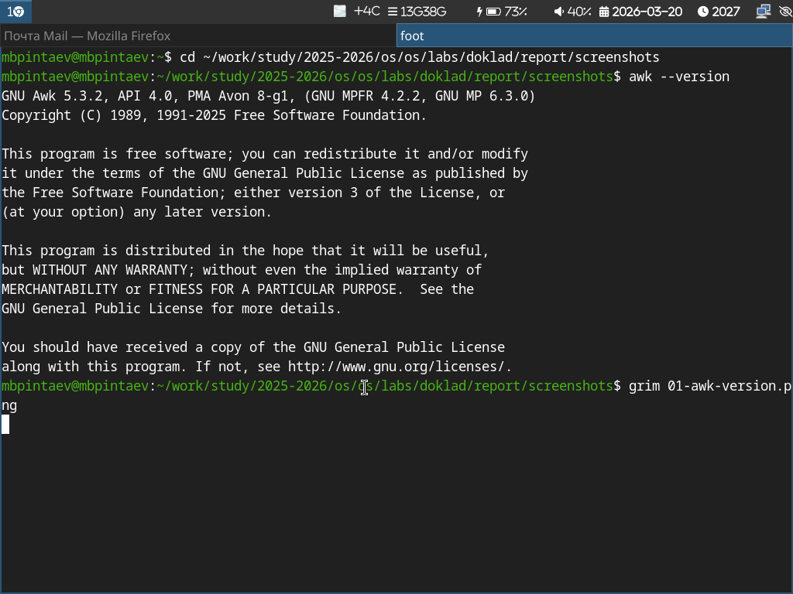
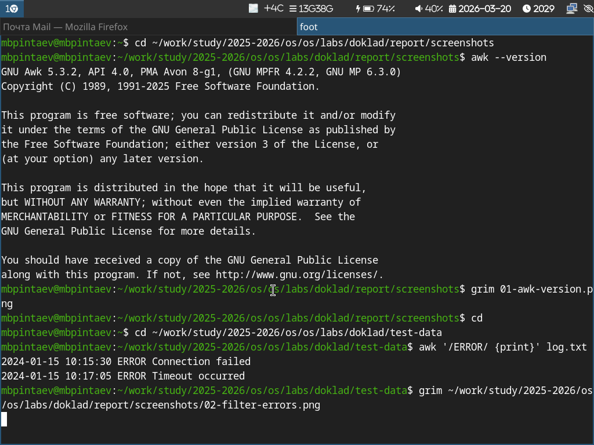
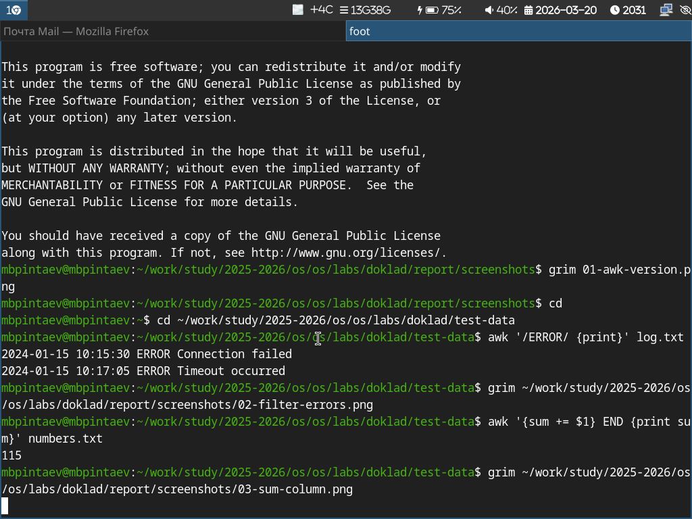
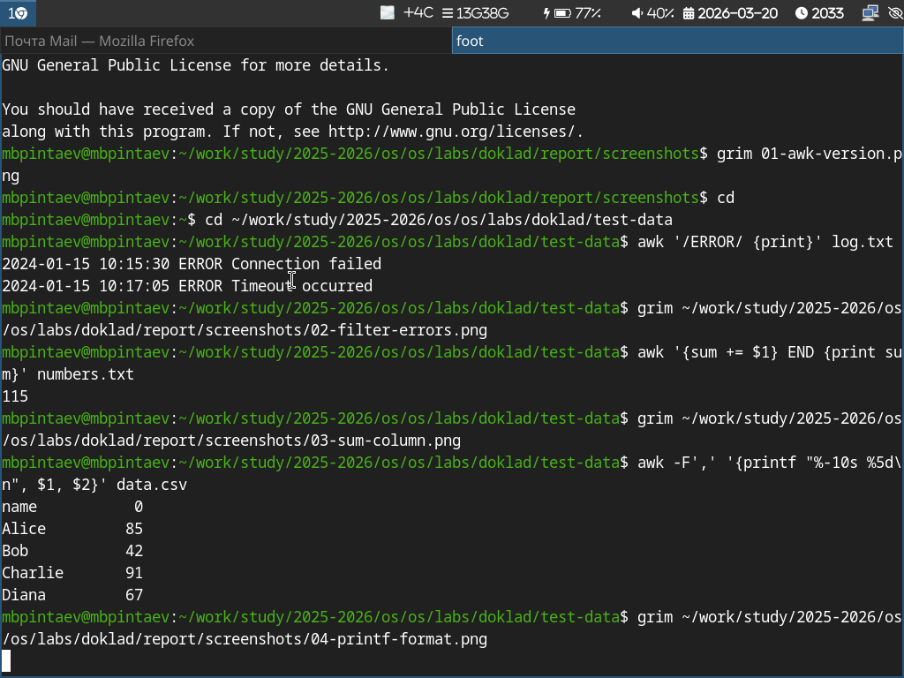
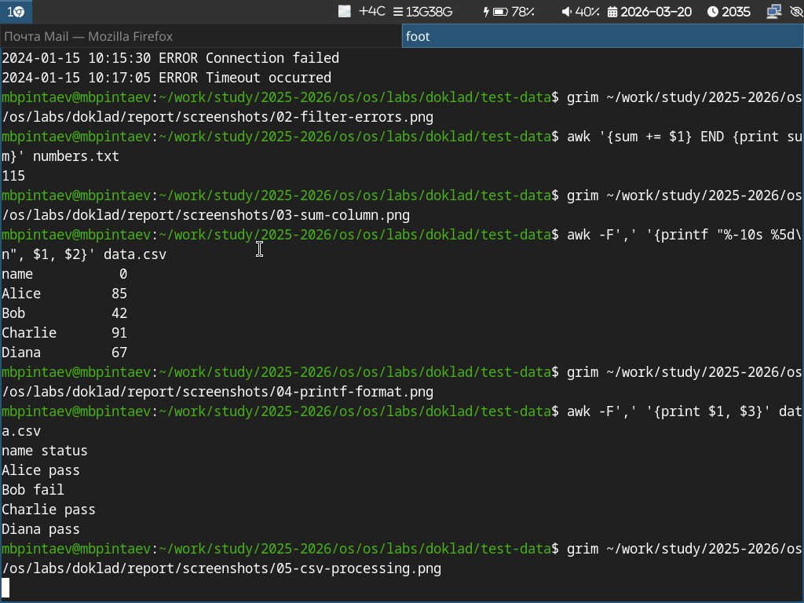
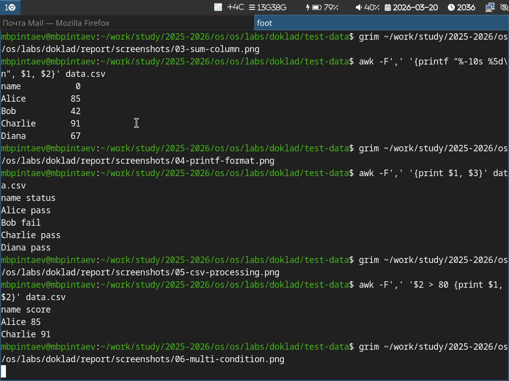

---
## Author
author:
  name: Пинтаев Максар Баирович
  email: 1032253534@pfur.ru
  affiliation:
    - name: Российский университет дружбы народов
      country: Российская Федерация
      postal-code: 117198
      city: Москва
      address: ул. Миклухо-Маклая, д. 6

## Title
title: "Применение awk для разбора текстовых файлов с данными"
subtitle: "Доклад по курсу «Архитектура компьютеров и операционные системы»"
license: "CC BY"
date: today
date-format: "YYYY-MM-DD"
---

# Информация

## Докладчик

  * Пинтаев Максар Баирович
  * студент
  * Российский университет дружбы народов им. П. Лумумбы
  * [1032253534@pfur.ru](mailto:1032253534@pfur.ru)
  * <https://github.com/maksar-lab>

# Вводная часть

## Актуальность

- Современный IT-специалист ежедневно работает с текстовыми данными
- Лог-файлы, CSV, конфигурации требуют быстрой обработки
- `awk` — мощный и эффективный инструмент для этих задач

## Цель и задачи

**Цель:** Изучить возможности утилиты `awk` для обработки текстовых файлов.

**Задачи:**
1. Рассмотреть синтаксис и основные конструкции `awk`
2. Разработать практические примеры обработки данных
3. Продемонстрировать эффективность `awk`

## Материалы и методы

- Операционная система: Fedora Sway
- GNU Awk 5.x
- Тестовые данные: логи, CSV, числовые файлы

{width=70%}

# Содержание исследования

## Что такое awk?

- Утилита командной строки для обработки текстовых файлов
- Язык программирования для работы со структурированными данными
- Синтаксис: `awk 'условие {действие}' файл`

## Базовый синтаксис

- Строки автоматически разбиваются на поля
- `$1`, `$2`, ... — доступ к полям
- `$0` — вся строка целиком
- `NR` — номер строки
- `NF` — количество полей

## Пример 1. Фильтрация строк

Вывод только строк, содержащих ошибку:

{width=70%}

Пример 2. Суммирование данных
Подсчёт суммы чисел в первом столбце:

{width=70%}

Пример 3. Форматированный вывод
Вывод с выравниванием:

{width=70%}

Пример 4. Обработка CSV
Использование разделителя-запятой:

{width=70%}

Пример 5. Сложные условия
Выбор строк по условию:

{width=70%}

Анализ эффективности
Преимущества awk
Скорость: потоковая обработка, не требует загрузки всего файла в память
Простота: компактный синтаксис для распространённых задач
Гибкость: легко встраивается в конвейеры команд

Заключение
Выводы
awk — мощный инструмент для обработки текстовых данных
Позволяет решать широкий круг задач: фильтрация, суммирование, форматирование
Значительно повышает эффективность работы с текстовыми файлами

Перспективы
Изучение встроенных функций awk
Использование в сценариях системного администрирования
Интеграция с grep, sed, sort
