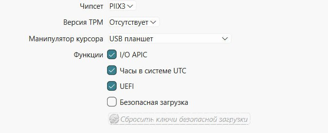
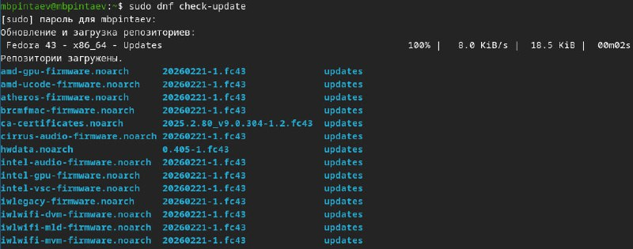

---
## Author
author:
  name: Пинтаев Максар Баирович
  affiliation:
    - name: Российский университет дружбы народов
      country: Российская Федерация
      postal-code: 117198
      city: Москва
      address: ул. Миклухо-Маклая, д. 6
## Title
title: Лабораторная работа №1
subtitle: Установка операционной системы Linux
license: CC BY
date: today
date-format: "YYYY-MM-DD"
---

# Информация

## Докладчик

:::::::::::::: {.columns align=center}
::: {.column width="70%"}

  * Пинтаев Максар Баирович
  * студент
  * Российский университет дружбы народов им. П. Лумумбы
  * [1032253534@pfur.ru](mailto:1032253534@pfur.ru)
  * <https://github.com/maksar-lab>

:::
::: {.column width="30%"}

:::
::::::::::::::

# Вводная часть

## Актуальность

- Операционные системы семейства Linux широко используются в профессиональной среде
- Виртуальные машины позволяют изучать ОС без риска повредить основную систему
- Fedora Sway — современный дистрибутив с тайлинговым оконным менеджером

## Объект и предмет исследования

- Объект: процесс установки операционной системы Linux
- Предмет: установка и базовая настройка Fedora Sway на виртуальную машину

## Цели и задачи

Цель работы: Приобретение практических навыков установки ОС Linux на виртуальную машину и её базовой настройки.

Задачи:
1. Установить Fedora Sway на виртуальную машину
2. Выполнить базовую настройку системы
3. Проанализировать загрузку системы с помощью dmesg

## Материалы и методы

- VirtualBox — среда виртуализации
- Дистрибутив Fedora Sway (Live-образ)
- Командная строка Linux для настройки и анализа
- Утилиты: dmesg, uname, dnf

# Выполнение работы

## Создание виртуальной машины

- Создана виртуальная машина с именем mbpintaev_os-intro
- Параметры:
  - RAM: 2048 МБ
  - HDD: 80 ГБ, динамический, VDI
  - Включены UEFI и общий буфер обмена

{width=60%}

{width=60%}

## Установка операционной системы

- Загружен Live-образ Fedora Sway
- В терминале запущена команда liveinst
- В установщике заданы:
  - Пароль для root
  - Пользователь mbpintaev
  - Имя хоста mbpintaev

{width=60%}

{width=60%}

## Завершение установки

- После завершения установки выполнена перезагрузка
- Выполнен вход в систему под созданным пользователем
- Система готова к работе

{width=60%}

## Информация о системе

- Проверена версия ядра: 6.11.4-200.fc40.x86_64
- Определены характеристики процессора и ОЗУ
- Корневая файловая система: ext4

{width=60%}

Обновление системы
Выполнено обновление всех пакетов:

{width=60%}

Настройка раскладки клавиатуры
Добавлена возможность переключения раскладки us/ru по правому Ctrl

Конфигурация добавлена в /etc/X11/xorg.conf.d/00-keyboard.conf

{width=60%}

Результаты
Полученные результаты
Установлена и настроена ОС Fedora Sway на виртуальной машине

Выполнен анализ загрузки системы

Система готова к выполнению дальнейших лабораторных работ

Выводы
Итоговый слайд
Вывод: В ходе работы приобретены практические навыки установки и базовой настройки ОС Linux, необходимые для дальнейшего изучения операционных систем и работы в профессиональной среде.
