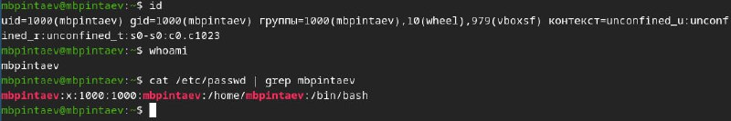
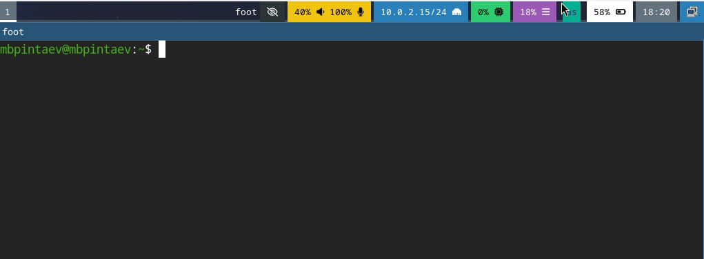
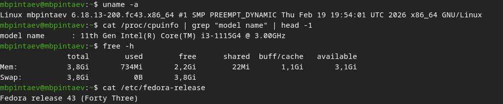

---
## Author
author:
  name: Пинтаев Максар Баирович
  email: 1032253534@pfur.ru
  affiliation:
    - name: Российский университет дружбы народов
      country: Российская Федерация
      postal-code: 117198
      city: Москва
      address: ул. Миклухо-Маклая, д. 6

## Title
title: "Отчёт по лабораторной работе №1"
subtitle: "Установка операционной системы Linux"
license: "CC BY"
date: today
---

# Цель работы

Приобретение практических навыков установки ОС Linux на виртуальную машину и её базовой настройки.

# Задание

1. Установить Fedora Sway на виртуальную машину.
2. Выполнить базовую настройку системы.
3. Проанализировать загрузку с помощью dmesg.

# Выполнение работы

## Создание виртуальной машины

В VirtualBox создана виртуальная машина с именем mbpintaev_os-intro. Параметры: RAM 2048 МБ, HDD 80 ГБ, VDI, включены UEFI и общий буфер обмена.

## Установка операционной системы

Подключён образ Fedora Sway. После загрузки в терминале выполнена команда liveinst для запуска установщика.

В процессе установки заданы:
- Пароль для root
- Пользователь mbpintaev с паролем
- Имя хоста mbpintaev

После завершения установки выполнена перезагрузка.

## Первый вход и анализ системы

После входа в систему открыт терминал (Win+Enter). Проверена информация о системе:

Полученные данные:

Версия ядра: 6.11.4-200.fc40.x86_64

Процессор: Intel Core i3-550

ОЗУ: 2048 МБ

Корневая ФС: ext4

Обновление системы
Выполнено обновление всех пакетов:

Настройка раскладки клавиатуры
Для удобства добавлена возможность переключения раскладки us/ru по правому Ctrl:

Выводы
В ходе работы установлена ОС Linux на виртуальную машину, выполнены базовая настройка и анализ загрузки системы. Полученные навыки являются основой для дальнейшей работы в ОС Linux.
