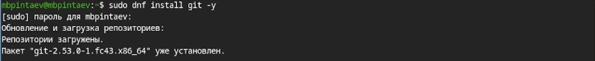
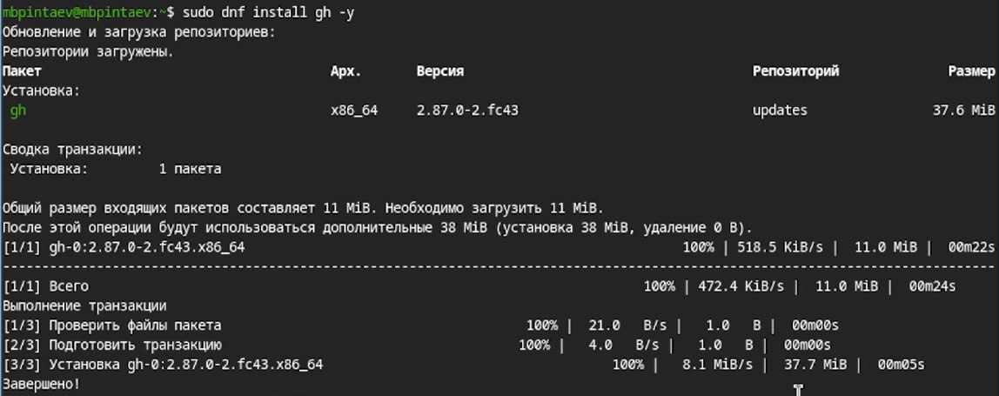
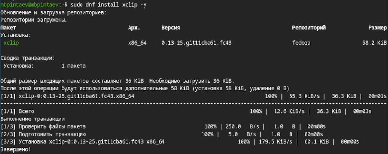
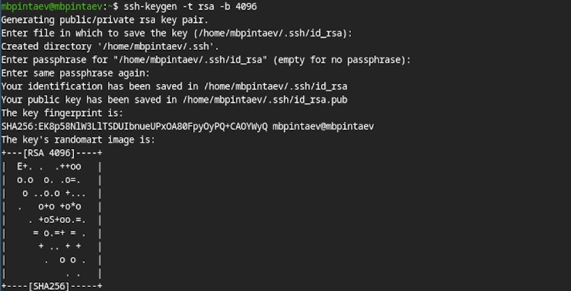
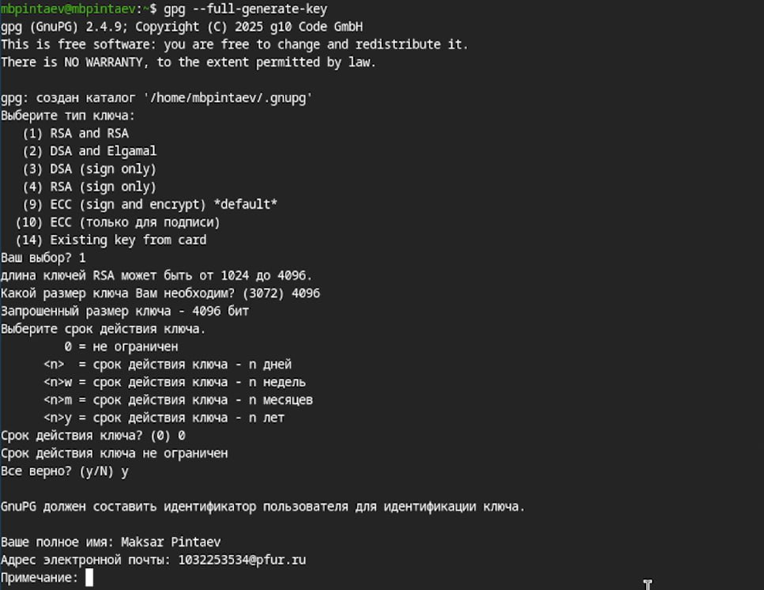
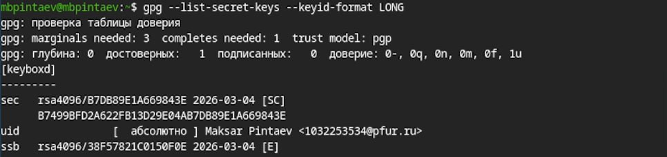
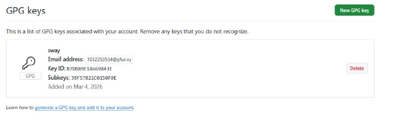
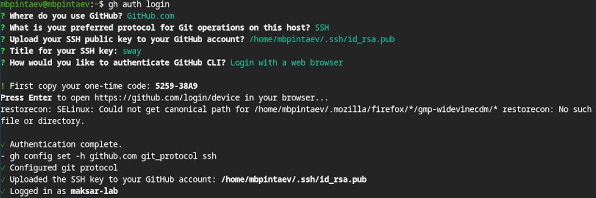
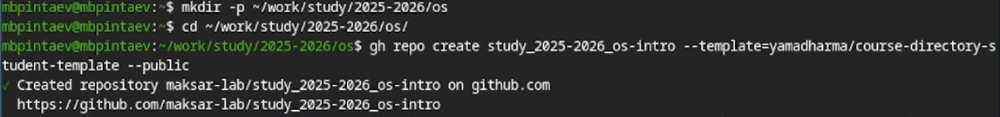

---
## Author
author:
  name: Пинтаев Максар Баирович
  email: 1032253534@pfur.ru
  affiliation:
    - name: Российский университет дружбы народов
      country: Российская Федерация
      postal-code: 117198
      city: Москва
      address: ул. Миклухо-Маклая, д. 6

## Title
title: "Отчёт по лабораторной работе №2"
subtitle: "Первоначальная настройка git"
license: "CC BY"
date: today
---

# Цель работы

Изучить идеологию и применение средств контроля версий. Освоить умения по работе с git.

# Задание

1. Создать базовую конфигурацию для работы с git.
2. Создать ключи SSH и PGP.
3. Настроить подписи коммитов git.
4. Зарегистрироваться на GitHub.
5. Создать локальный каталог для выполнения заданий по предмету.

# Выполнение лабораторной работы

## Установка программного обеспечения

Для работы были установлены Git, GitHub CLI и xclip ([рис. @fig:install-git], [рис. @fig:install-gh], [рис. @fig:install-xclip]).

{#fig:install-git}

{#fig:install-gh}

{#fig:install-xclip}

## Базовая настройка git

Заданы имя пользователя и email владельца репозитория, настроена кодировка UTF-8, задано имя начальной ветки master, настроены параметры autocrlf и safecrlf ([рис. @fig:git-config]).

{#fig:git-config}

## Создание SSH-ключей

Созданы SSH-ключи по алгоритмам RSA (4096 бит) и ed25519 ([рис. @fig:ssh-keygen]).

{#fig:ssh-keygen}

## Создание GPG-ключа

Создан GPG-ключ с типом RSA, размером 4096 бит, без срока действия ([рис. @fig:gpg-generate]). Отпечаток ключа получен командой gpg --list-secret-keys ([рис. @fig:gpg-list]).

{#fig:gpg-generate}

{#fig:gpg-list}

## Настройка GitHub

На сайте GitHub были добавлены SSH и GPG ключи ([рис. @fig:github-keys]).

{#fig:github-keys}

## Настройка подписей коммитов git и настройка gh

Указан ключ для подписи коммитов, включена автоматическая подпись, указана программа gpg ([рис. @fig:git-signing]). Выполнена авторизация в GitHub CLI через браузер ([рис. @fig:gh-auth]).

{#fig:git-signing}

{#fig:gh-auth}

## Создание репозитория на GitHub

Создан локальный каталог и выполнено клонирование файлов из репозитория-шаблона ([рис. @fig:repo-create]).

{#fig:repo-create}

## Отправка изменений на GitHub

Выполнена настройка репозитория: удалён package.json, создан файл COURSE, выполнена команда make prepare для создания структуры каталогов. Изменения отправлены на GitHub ([рис. @fig:git-push]).

{#fig:git-push}

# Выводы

В ходе выполнения работы изучена система контроля версий и освоены навыки работы с git. Выполнена базовая настройка git, созданы ключи SSH и PGP, настроены подписи коммитов, создан локальный каталог для выполнения заданий
 
