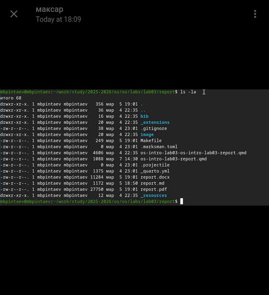

---
## Author
author:
  name: Пинтаев Максар Баирович
  email: 1032253534@pfur.ru
  affiliation:
    - name: Российский университет дружбы народов
      country: Российская Федерация
      postal-code: 117198
      city: Москва
      address: ул. Миклухо-Маклая, д. 6

## Title
title: "Презентация по лабораторной работе №3"
subtitle: "Оформление отчётов в Markdown"
license: "CC BY"
date: today
date-format: "YYYY-MM-DD"
---

# Информация

## Докладчик

:::::::::::::: {.columns align=center}
::: {.column width="70%"}

  * Пинтаев Максар Баирович
  * студент
  * Российский университет дружбы народов им. П. Лумумбы
  * [1032253534@pfur.ru](mailto:1032253534@pfur.ru)
  * <https://github.com/maksar-lab>

:::
::: {.column width="30%"}

{width=100%}

:::
::::::::::::::

# Вводная часть

## Актуальность

- Markdown — стандарт оформления технической документации
- Pandoc позволяет конвертировать Markdown в различные форматы
- Автоматизация создания отчётов экономит время

## Объект и предмет исследования

- Объект: языки разметки документов
- Предмет: оформление отчётов в Markdown и их конвертация

## Цели и задачи

Цель работы: Научиться оформлять отчёты с помощью языка разметки Markdown.

Задачи:
1. Создать отчёт по предыдущей лабораторной работе в Markdown
2. Сконвертировать его в PDF и DOCX с помощью pandoc
3. Автоматизировать процесс с помощью Makefile

## Материалы и методы

- Язык разметки Markdown
- Конвертер pandoc
- Makefile для автоматизации
- LaTeX (XeLaTeX) для генерации PDF

# Выполнение работы

## Подготовка рабочего каталога

Для выполнения работы был создан каталог:

Создание отчёта в Markdown
В качестве основы был взят отчёт по лабораторной работе №2, написанный в Markdown (рис. @fig:lab02-report).

![Отчет в markdown].(/image/lab02-report-content.png){#fig:lab02-report width=70%}

Автоматизация с Makefile
Для автоматизации процесса конвертации был создан Makefile (рис. @fig:makefile).

![Makefile].(/image/makefile-content.png){#fig:makefile width=70%}

Конвертация в PDF и DOCX
С помощью pandoc выполнена конвертация:

Результат конвертации
В результате получены файлы в форматах PDF и DOCX (рис. @fig:result).

{#fig:result width=70%}

Результаты
Полученные результаты
Создан отчёт по лабораторной работе №2 в Markdown

Получены PDF и DOCX версии отчёта

Процесс автоматизирован с помощью Makefile

Вывод: В ходе работы освоены навыки оформления отчётов в Markdown и их конвертации в различные форматы. Полученные навыки позволяют эффективно создавать структурированную документацию.
