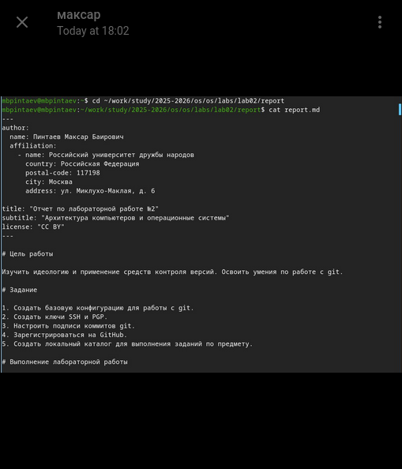
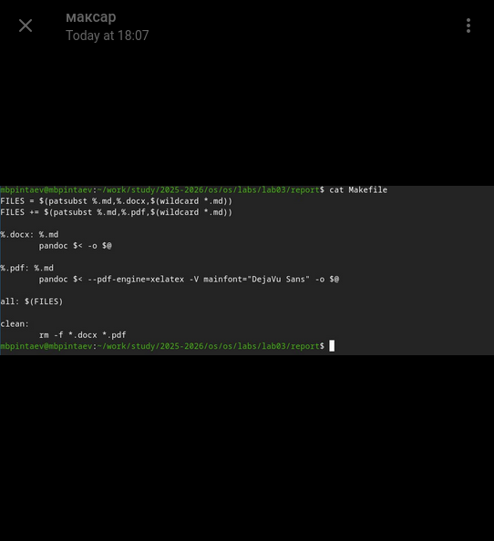

---
## Author
author:
  name: Пинтаев Максар Баирович
  email: 1032253534@pfur.ru
  affiliation:
    - name: Российский университет дружбы народов
      country: Российская Федерация
      postal-code: 117198
      city: Москва
      address: ул. Миклухо-Маклая, д. 6

## Title
title: "Отчёт по лабораторной работе №3"
subtitle: "Оформление отчётов в Markdown"
license: "CC BY"
date: today
---

# Цель работы

Научиться оформлять отчёты с помощью языка разметки Markdown.

# Задание

Сделать отчёт по предыдущей лабораторной работе в формате Markdown и сконвертировать его в PDF и DOCX.

# Выполнение лабораторной работы

## Содержимое отчёта по лабораторной работе №2

Для выполнения работы был взят отчёт по лабораторной работе №2, написанный в Markdown (рис. @fig:lab02-report).

{#fig:lab02-report width=70%}

## Автоматизация конвертации

Для автоматизации процесса конвертации был создан Makefile (рис. @fig:makefile).

{#fig:makefile width=70%}

## Результат конвертации

С помощью команд make all были получены файлы в форматах PDF и DOCX (рис. @fig:conversion-result).
{#fig:conversion-result width=70%}

Выводы
В ходе работы освоены навыки оформления отчётов с помощью Markdown и конвертации их в различные форматы через pandoc. Полученные навыки позволяют создавать структурированные и хорошо оформленные отчёты для лабораторных работ.
