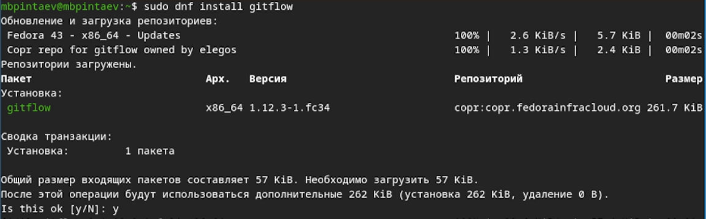
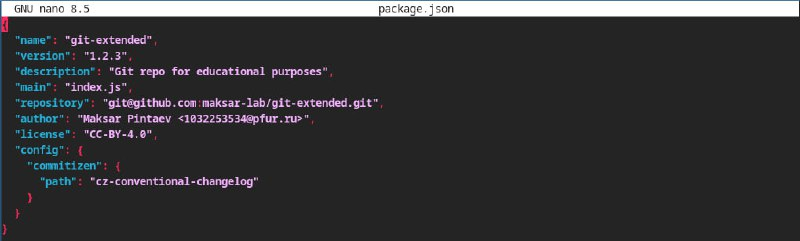
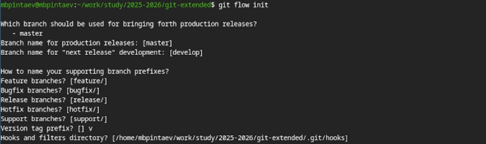
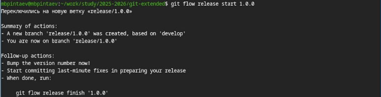
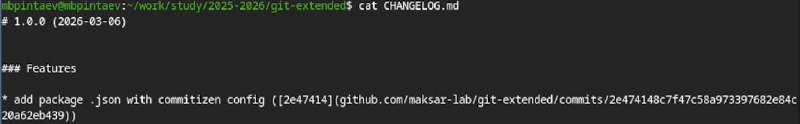
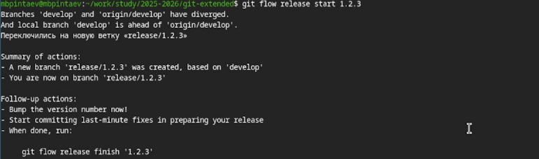

---
## Author
author:
  name: Пинтаев Максар Баирович
  email: 1032253534@pfur.ru
  affiliation:
    - name: Российский университет дружбы народов
      country: Российская Федерация
      postal-code: 117198
      city: Москва
      address: ул. Миклухо-Маклая, д. 6

## Title
title: "Презентация по лабораторной работе №4"
subtitle: "Продвинутое использование git"
license: "CC BY"
date: today
date-format: "YYYY-MM-DD"
---

# Информация

## Докладчик

:::::::::::::: {.columns align=center}
::: {.column width="70%"}

  * Пинтаев Максар Баирович
  * студент
  * Российский университет дружбы народов им. П. Лумумбы
  * [1032253534@pfur.ru](mailto:1032253534@pfur.ru)
  * <https://github.com/maksar-lab>

:::
::: {.column width="30%"}

{width=100%}

:::
::::::::::::::

# Вводная часть

## Актуальность

- Gitflow — популярная модель ветвления для командной разработки
- Семантическое версионирование упрощает управление версиями
- Conventional Commits стандартизируют сообщения коммитов

## Объект и предмет исследования

- Объект: системы контроля версий
- Предмет: продвинутые методы работы с git

## Цели и задачи

Цель работы: Получение навыков правильной работы с репозиториями git: использование git-flow, семантического версионирования и общепринятых коммитов.

Задачи:
1. Установить необходимое ПО (git-flow, commitizen, standard-changelog)
2. Создать репозиторий и настроить conventional commits
3. Инициализировать git-flow
4. Создать релизы v1.0.0 и v1.2.3

## Материалы и методы

- Git и git-flow
- GitHub CLI (gh)
- commitizen для стандартизации коммитов
- standard-changelog для генерации журнала изменений

# Выполнение работы

## Установка программного обеспечения

Были установлены необходимые программы: git-flow, Node.js, pnpm, commitizen и standard-changelog (рис. @fig:gitflow-install).
{#fig:gitflow-install width=70%}

Настройка package.json
Был инициализирован и настроен package.json для работы с commitizen (рис. @fig:package-json).

{#fig:package-json width=70%}

Инициализация git-flow
Репозиторий был инициализирован для работы с git-flow с префиксом тегов v (рис. @fig:git-flow-init).
{#fig:git-flow-init width=70%}

Создание первого релиза (v1.0.0)
Был создан первый релиз и сгенерирован CHANGELOG.md (рис. @fig:changelog-first).

{#fig:changelog-first width=70%}

{#fig:release-finish width=70%}

Публикация релиза на GitHub
Релиз был опубликован с помощью GitHub CLI (рис. @fig:github-release-v1.0.0).

{#fig:github-release-v1.0.0 width=70%}

Работа с функциональной веткой
Была создана feature-ветка и добавлен новый файл (рис. @fig:feature-branch).

{#fig:feature-branch width=70%}

Создание второго релиза (v1.2.3)
Был создан второй релиз с обновлённым CHANGELOG.md (рис. @fig:github-releases-final).

{#fig:github-releases-final width=70%}

Результаты
Полученные результаты
Настроен репозиторий с git-flow

Созданы релизы v1.0.0 и v1.2.3

Автоматически сгенерирован CHANGELOG.md

Все изменения опубликованы на GitHub

Вывод: В ходе работы освоены продвинутые методы работы с git, включая git-flow, семантическое версионирование и общепринятые коммиты. Полученные навыки позволяют эффективно организовать командную разработку и управление версиями проекта.
