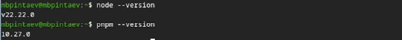
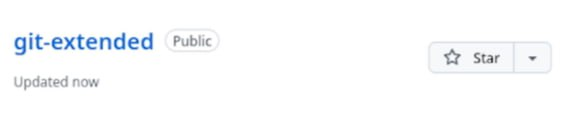
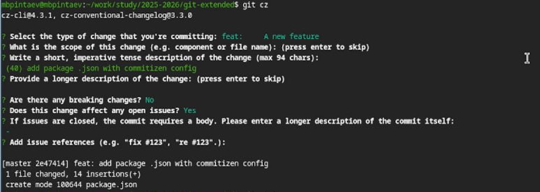
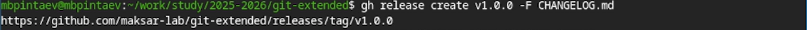
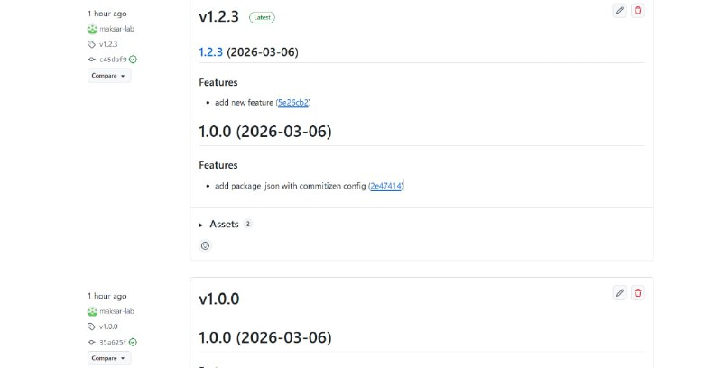

# Цель работы

Получение навыков правильной работы с репозиториями git: использование git-flow, семантического версионирования и общепринятых коммитов.

# Задание

1. Выполнить работу для тестового репозитория.
2. Преобразовать рабочий репозиторий в репозиторий с git-flow и conventional commits.

# Выполнение лабораторной работы

## Установка программного обеспечения

Для выполнения работы были установлены необходимые программы: git-flow, Node.js, pnpm, commitizen и standard-changelog.

```bash
sudo dnf copr enable elegos/gitflow
sudo dnf install gitflow
sudo dnf install nodejs pnpm -y
pnpm setup
source ~/.bashrc
pnpm add -g commitizen
pnpm add -g standard-changelog
https://screenshots/01-gitflow-install.png

https://screenshots/02-nodejs-pnpm.png

Создание репозитория на GitHub
Был создан новый репозиторий git-extended на GitHub без инициализации README.

https://screenshots/03-github-repo-create.png

Локально был инициализирован репозиторий и создан первый коммит:




Создание репозитория на GitHub
Был создан новый репозиторий git-extended на GitHub без инициализации README.


Локально был инициализирован репозиторий и создан первый коммит:

bash
cd ~/work/study/2025-2026
mkdir git-extended
cd git-extended
echo "# git-extended" > README.md
git init
git add README.md
git commit -m "first commit"
git branch -M master
git remote add origin git@github.com:maksar-lab/git-extended.git
git push -u origin master
Конфигурация общепринятых коммитов
Был инициализирован package.json и настроен commitizen:

pnpm init
После редактирования файл package.json приобрёл следующий вид:

json
{
  "name": "git-extended",
  "version": "1.0.0",
  "description": "Git repo for educational purposes",
  "main": "index.js",
  "repository": "git@github.com:maksar-lab/git-extended.git",
  "author": "Пинтаев Максар Баирович <1032253534@pfur.ru>",
  "license": "CC-BY-4.0",
  "config": {
    "commitizen": {
      "path": "cz-conventional-changelog"
    }
  }
}


Затем был выполнен коммит с помощью commitizen:

git add .
git cz
Был выбран тип feat и введено описание add package.json with commitizen config.


Инициализация git-flow
Репозиторий был инициализирован для работы с git-flow:

git flow init
При инициализации был установлен префикс для тегов v.


После инициализации были созданы ветки master и develop:

git branch -a


Ветки были отправлены на GitHub:

git push --all
git branch --set-upstream-to=origin/develop develop
Создание первого релиза (v1.0.0)
Была создана релизная ветка для версии 1.0.0:

git flow release start 1.0.0
Создан журнал изменений:

standard-changelog --first-release


Файл CHANGELOG.md был добавлен в индекс и закоммичен:

git add CHANGELOG.md
git commit -am 'chore(site): add changelog'
Завершение работы над релизом:

git flow release finish 1.0.0

После завершения все изменения были отправлены на GitHub:

bash
git push --all
git push --tags
Релиз был создан на GitHub с помощью утилиты gh:

bash
gh release create v1.0.0 -F CHANGELOG.md


Работа с функциональной веткой
Была создана ветка для новой функциональности:

bash
git flow feature start feature_branch
Добавлен новый файл:

bash
echo "Some new feature" > feature.txt
git add feature.txt
git commit -m 'feat: add new feature'


Завершение работы над функциональной веткой:

bash
git flow feature finish feature_branch

Создание второго релиза (v1.2.3)
Была создана релизная ветка для версии 1.2.3:

bash
git flow release start 1.2.3
Обновлена версия в package.json:

bash
nano package.json
# изменена версия с 1.0.0 на 1.2.3
Создан обновлённый журнал изменений:

bash
standard-changelog


Изменения были закоммичены:

bash
git add package.json CHANGELOG.md
git commit -am 'chore(site): update changelog for 1.2.3'
Завершение работы над релизом и отправка на GitHub:

bash
git flow release finish 1.2.3
git push --all
git push --tags
gh release create v1.2.3 -F CHANGELOG.md


Выводы
В ходе выполнения лабораторной работы были получены навыки правильной работы с репозиториями git. Был освоен рабочий процесс Gitflow, позволяющий эффективно организовать работу над проектом с использованием функциональных веток, релизных веток и веток исправлений. Также было изучено семантическое версионирование и использование общепринятых коммитов (Conventional Commits), что позволяет автоматически генерировать журнал изменений и управлять версиями проекта. Созданный репозиторий git-extended полностью настроен для работы по современным стандартам разработки программного обеспечения.
