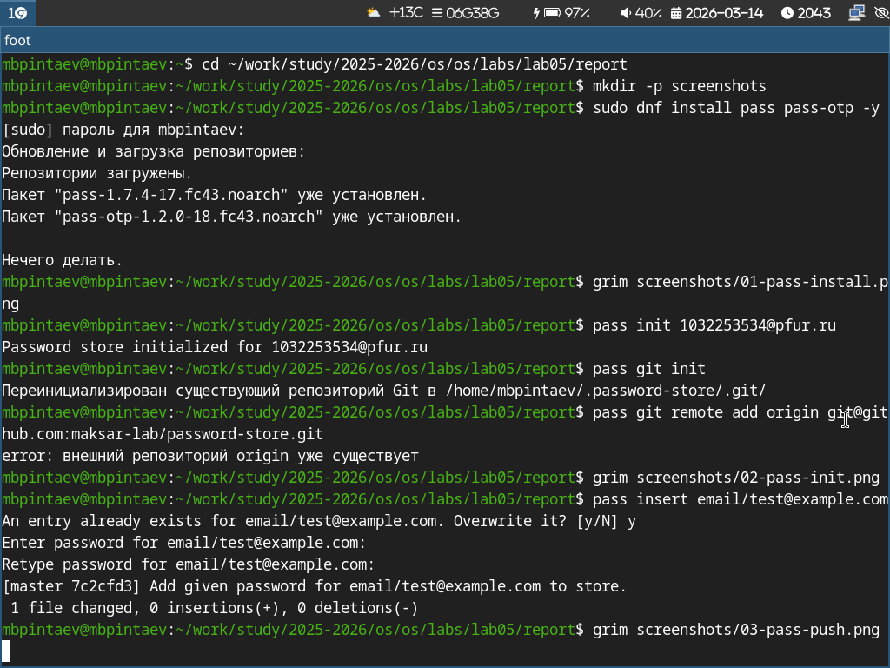
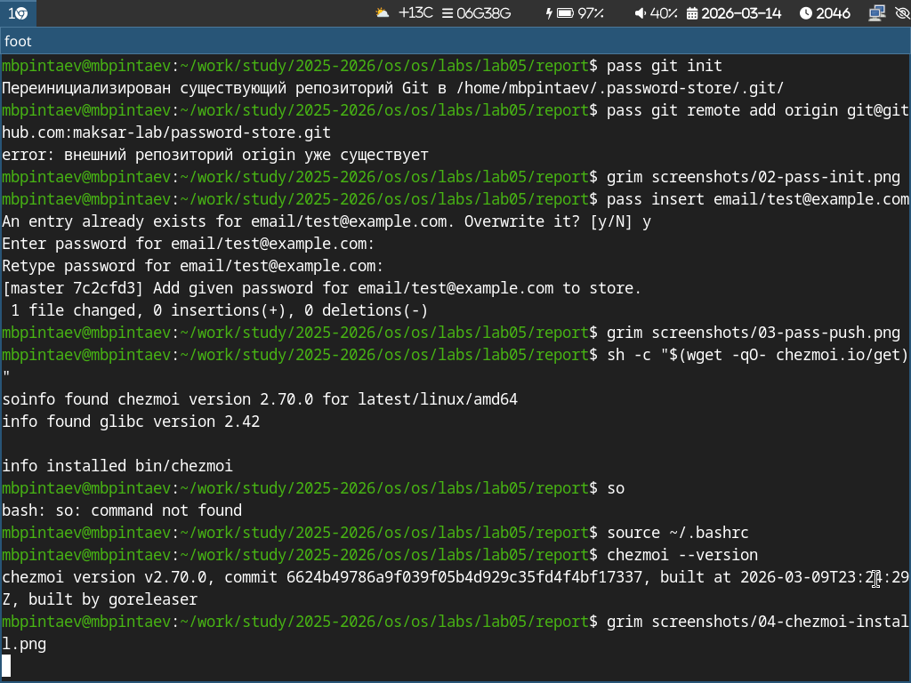

---
## Author
author:
  name: Пинтаев Максар Баирович
  email: 1032253534@pfur.ru
  affiliation:
    - name: Российский университет дружбы народов
      country: Российская Федерация
      postal-code: 117198
      city: Москва
      address: ул. Миклухо-Маклая, д. 6

## Title
title: "Презентация по лабораторной работе №5"
subtitle: "Менеджер паролей pass и управление конфигурациями с chezmoi"
license: "CC BY"
date: today
date-format: "YYYY-MM-DD"
---

# Информация

## Докладчик

:::::::::::::: {.columns align=center}
::: {.column width="70%"}

  * Пинтаев Максар Баирович
  * студент
  * Российский университет дружбы народов им. П. Лумумбы
  * [1032253534@pfur.ru](mailto:1032253534@pfur.ru)
  * <https://github.com/maksar-lab>

:::
::: {.column width="30%"}

{width=100%}

:::
::::::::::::::

# Вводная часть

## Актуальность

- Менеджеры паролей необходимы для безопасного хранения учётных данных
- Синхронизация конфигураций между разными машинами упрощает работу
- pass и chezmoi — стандартные инструменты в экосистеме Linux

## Цели и задачи

Цель работы: Настройка менеджера паролей pass и системы управления конфигурациями chezmoi.

Задачи:
1. Установить и настроить pass с синхронизацией на GitHub
2. Установить и настроить chezmoi для управления dotfiles

# Выполнение работы

## Установка pass

Менеджер паролей pass установлен с помощью пакетного менеджера (рис. @fig:pass-install).
{#fig:pass-install width=70%}

Инициализация хранилища
Хранилище инициализировано и подключено к git-репозиторию (рис. @fig:pass-init).

{#fig:pass-init width=70%}

Добавление и синхронизация пароля
Добавлен тестовый пароль и выполнена синхронизация с GitHub (рис. @fig:pass-push).

{#fig:pass-push width=70%}

Установка chezmoi
Установлен инструмент для управления конфигурационными файлами (рис. @fig:chezmoi-install).

{#fig:chezmoi-install width=70%}

Создание репозитория dotfiles
Создан приватный репозиторий и выполнена инициализация (рис. @fig:chezmoi-init).

{#fig:chezmoi-init width=70%}

Применение конфигурации
Изменения применены и настроена автосинхронизация (рис. @fig:chezmoi-apply).

{#fig:chezmoi-apply width=70%}

Заключение
Результаты работы
Настроен менеджер паролей pass с синхронизацией через GitHub

Установлен и настроен chezmoi для управления dotfiles

Создан репозиторий с конфигурационными файлами

Настроена автоматическая синхронизация изменений

Выводы
В ходе работы освоены современные инструменты для безопасного хранения паролей и управления конфигурациями, необходимые для эффективной работы в Linux-среде.
