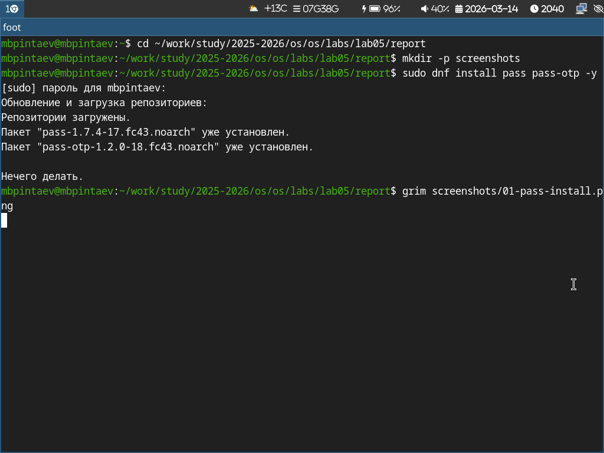
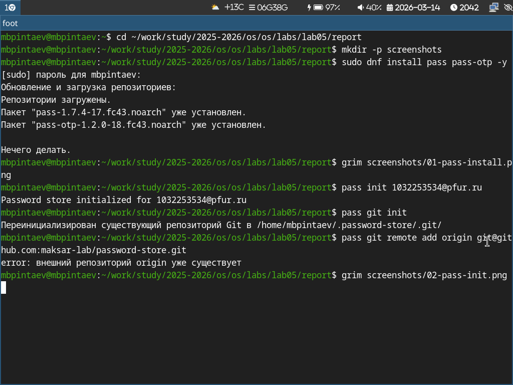
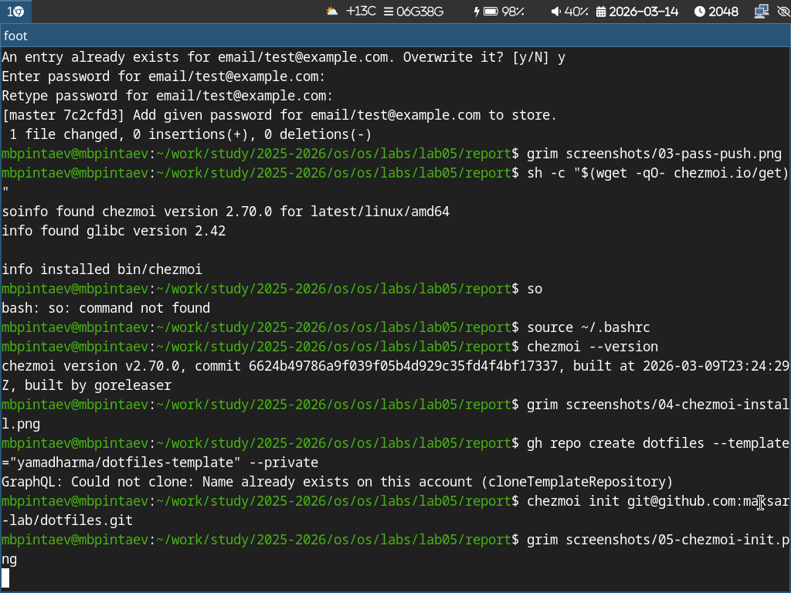
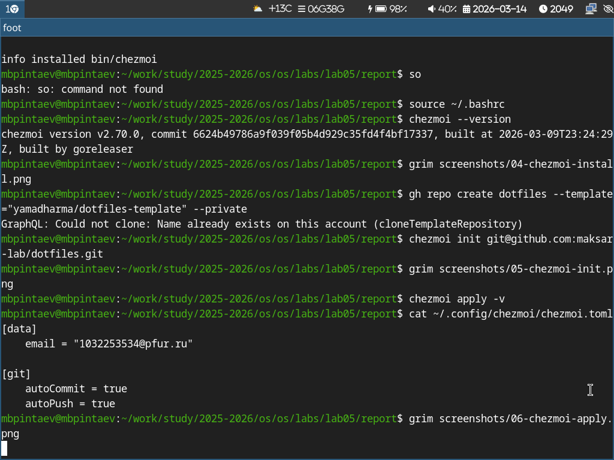

---

## Author

author:
  name: Пинтаев Максар Баирович
  email: 1032253534@pfur.ru
  affiliation:
    - name: Российский университет дружбы народов
      country: Российская Федерация
      postal-code: 117198
      city: Москва
      address: ул. Миклухо-Маклая, д. 6

## Title
title: "Отчёт по лабораторной работе №5"
subtitle: "Менеджер паролей pass и управление конфигурациями с chezmoi"
license: "CC BY"
date: today

---

# Цель работы

Настройка менеджера паролей pass с GPG-шифрованием и синхронизацией через git, а также настройка управления конфигурационными файлами с помощью chezmoi.

# Задание

1. Установить и настроить менеджер паролей pass с синхронизацией на GitHub.

2. Установить и настроить chezmoi для управления dotfiles.

# Выполнение лабораторной работы

## 1. Настройка менеджера паролей pass

### 1.1 Установка pass

Был установлен менеджер паролей pass (рис. @fig:pass-install).

{#fig:pass-install width=70%}

1.2 Инициализация хранилища

Хранилище инициализировано с использованием GPG-ключа и подключено к git (рис. @fig:pass-init).

{#fig:pass-init width=70%}

1.3 Добавление и синхронизация пароля

Добавлен тестовый пароль и выполнена синхронизация с GitHub (рис. @fig:pass-push).

{#fig:pass-push width=70%}

2. Управление файлами конфигурации с chezmoi

2.1 Установка chezmoi

Установлен инструмент для управления dotfiles (рис. @fig:chezmoi-install).

{#fig:chezmoi-install width=70%}

2.2 Создание репозитория и инициализация

Создан приватный репозиторий на GitHub и выполнена инициализация (рис. @fig:chezmoi-init).

{#fig:chezmoi-init width=70%}

2.3 Применение конфигурации
Изменения применены и настроена автосинхронизация (рис. @fig:chezmoi-apply).

{#fig:chezmoi-apply width=70%}

Выводы

В ходе работы установлен и настроен менеджер паролей pass с синхронизацией через GitHub. Освоена работа с chezmoi для управления конфигурационными файлами: создан репозиторий dotfiles, применена конфигурация и настроена автоматическая синхронизация.

