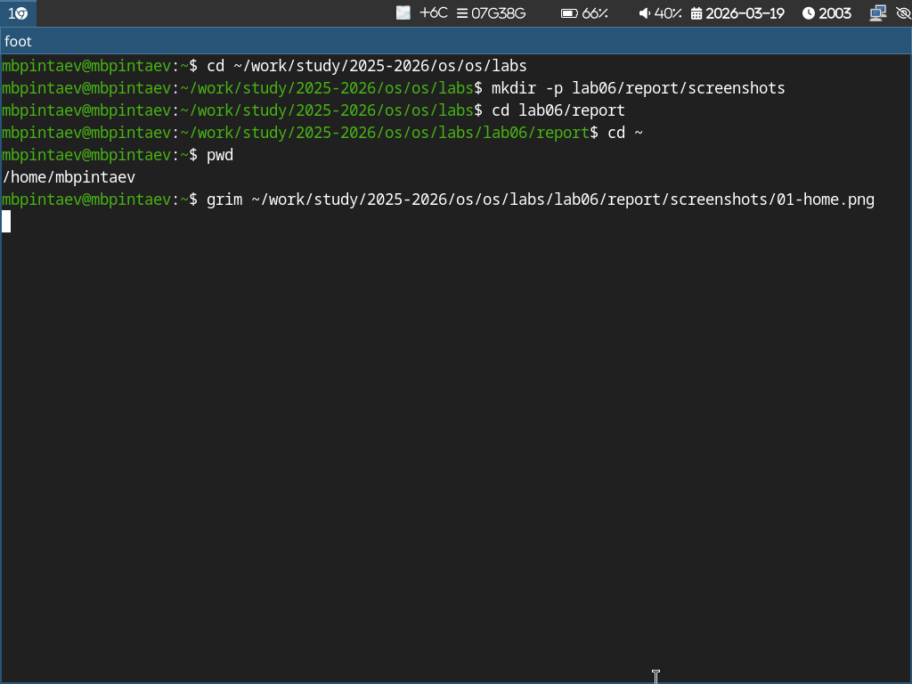
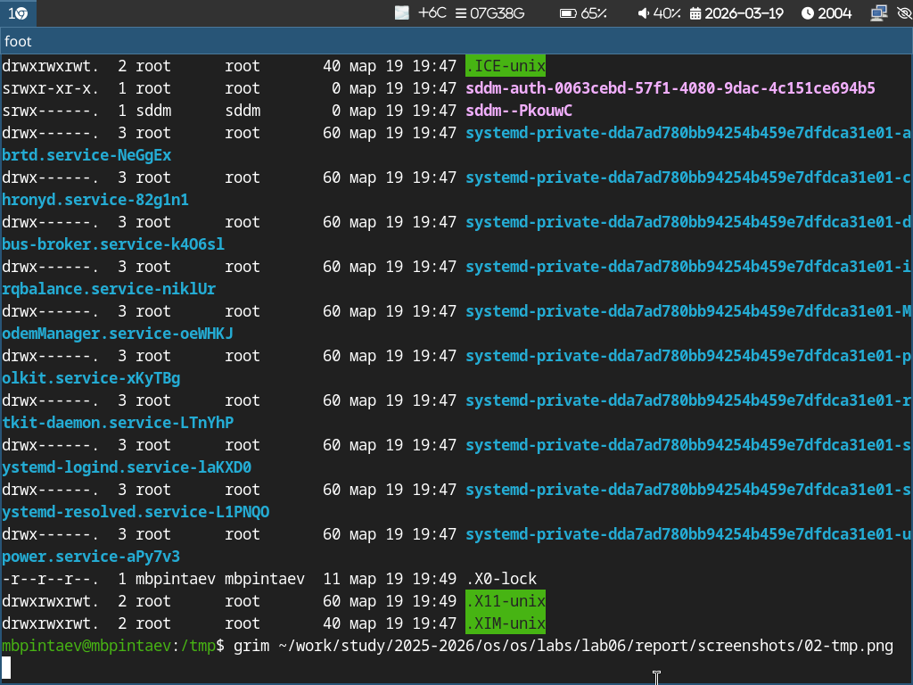
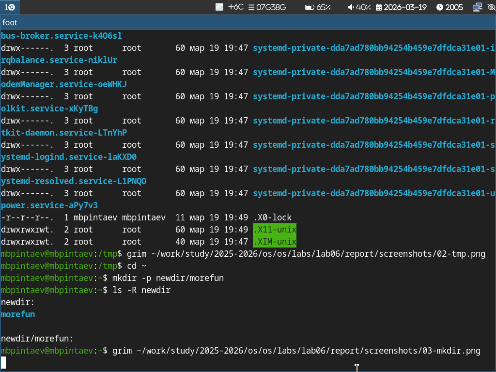
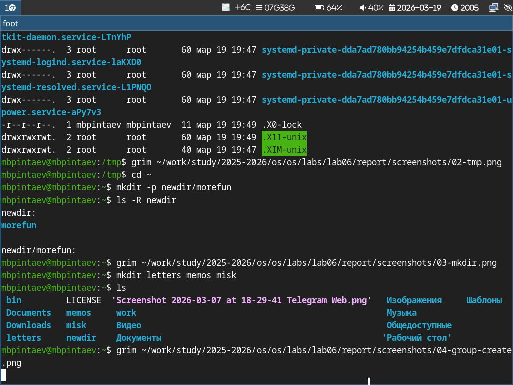
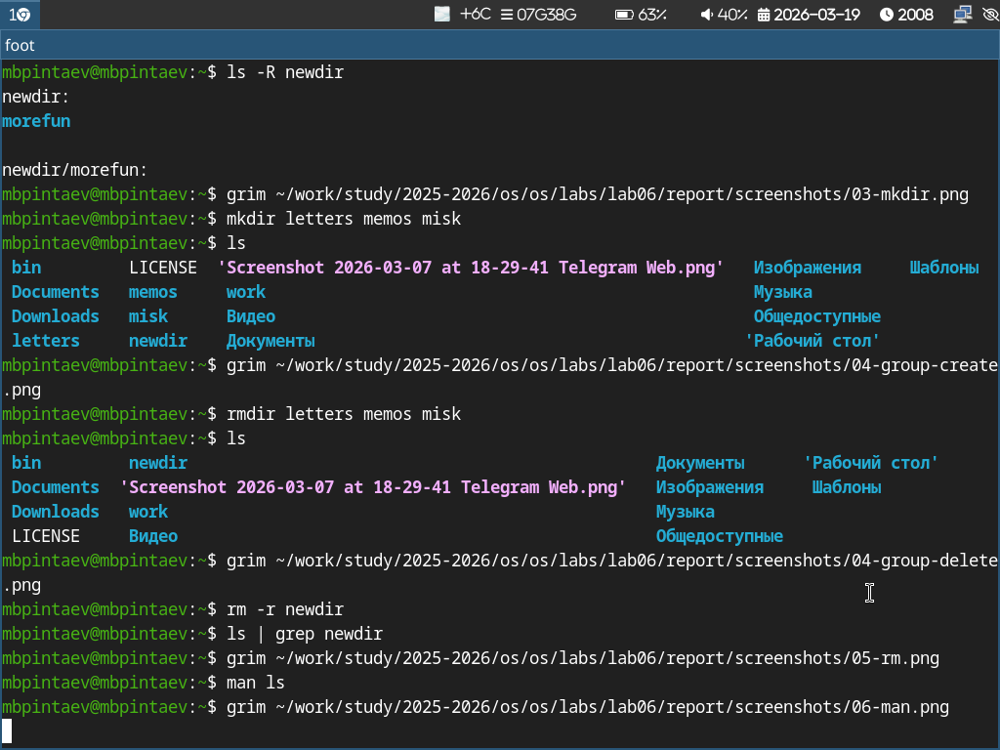

---
## Author
author:
  name: Пинтаев Максар Баирович
  email: 1032253534@pfur.ru
  affiliation:
    - name: Российский университет дружбы народов
      country: Российская Федерация
      postal-code: 117198
      city: Москва
      address: ул. Миклухо-Маклая, д. 6

## Title
title: "Презентация по лабораторной работе №6"
subtitle: "Основы интерфейса командной строки Unix"
license: "CC BY"
date: today
date-format: "YYYY-MM-DD"
---

# Информация

## Докладчик

:::::::::::::: {.columns align=center}
::: {.column width="70%"}

  * Пинтаев Максар Баирович
  * студент
  * Российский университет дружбы народов им. П. Лумумбы
  * [1032253534@pfur.ru](mailto:1032253534@pfur.ru)
  * <https://github.com/maksar-lab>

:::
::: {.column width="30%"}

{width=100%}

:::
::::::::::::::

# Вводная часть

## Актуальность

- Командная строка — основной способ взаимодействия с Unix-системами
- Навыки работы в терминале необходимы для администраторов и разработчиков
- Понимание базовых команд — фундамент для дальнейшего изучения ОС

## Цели и задачи

**Цель работы:** Приобретение практических навыков взаимодействия пользователя с системой посредством командной строки.

**Задачи:**
1. Освоить навигацию по файловой системе
2. Научиться создавать и удалять каталоги
3. Изучить работу с документацией (man)
4. Освоить работу с историей команд

## Материалы и методы

- Операционная система Fedora Sway
- Командный интерпретатор Bash
- Встроенные команды Linux: pwd, cd, ls, mkdir, rmdir, rm, man, history

# Выполнение работы

## Навигация по файловой системе

Определение полного пути к домашнему каталогу (рис. @fig:home):
{#fig:home width=70%}

Просмотр содержимого каталога
Просмотр содержимого каталога /tmp с различными опциями (рис. @fig:tmp):

{#fig:tmp width=70%}

Создание иерархии каталогов
Создание структуры newdir/morefun (рис. @fig:mkdir):

{#fig:mkdir width=70%}

Групповое создание каталогов
Создание нескольких каталогов одной командой (рис. @fig:group-create):

{#fig:group-create width=70%}

Удаление каталогов
Удаление группы каталогов и каталога с содержимым (рис. @fig:rm):

{#fig:rm width=70%}

Работа с man и историей команд
Изучение документации и работа с историей (рис. @fig:man-history):

{#fig:man-history width=70%}

Заключение
Результаты работы
Освоены основные команды навигации: pwd, cd, ls

Изучены команды создания и удаления каталогов: mkdir, rmdir, rm

Настроена работа с документацией через man

Освоено использование истории команд

Выводы
В ходе работы приобретены практические навыки взаимодействия с системой через командную строку, необходимые для дальнейшей работы в операционной системе Linux.
