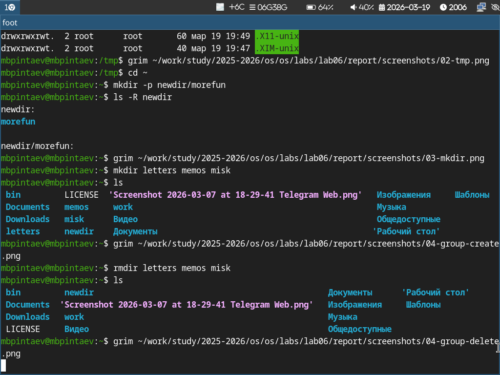
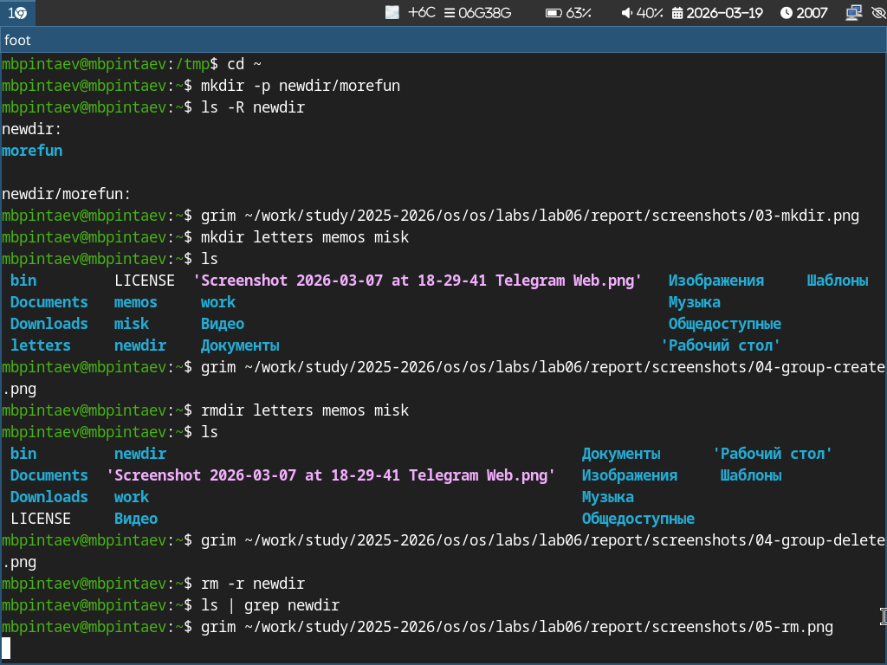
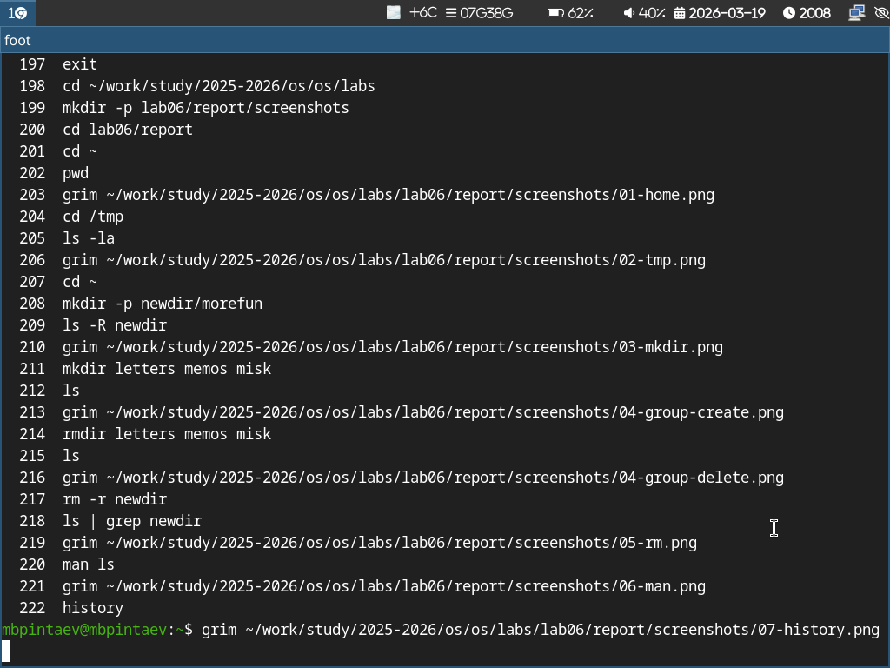
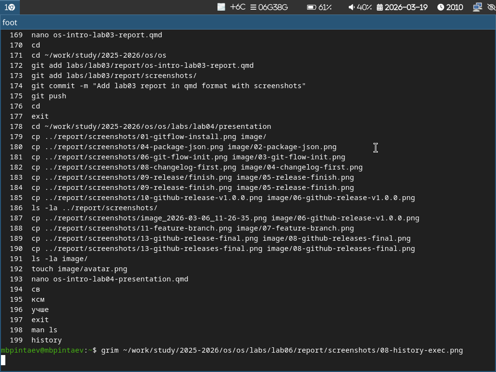

---
## Author
author:
  name: Пинтаев Максар Баирович
  email: 1032253534@pfur.ru
  affiliation:
    - name: Российский университет дружбы народов
      country: Российская Федерация
      postal-code: 117198
      city: Москва
      address: ул. Миклухо-Маклая, д. 6

## Title
title: "Отчёт по лабораторной работе №6"
subtitle: "Основы интерфейса командной строки Unix"
license: "CC BY"
date: today
---

# Цель работы

Приобретение практических навыков взаимодействия пользователя с системой посредством командной строки.

# Задание

1. Определить полное имя домашнего каталога.
2. Выполнить навигацию и просмотр содержимого каталогов.
3. Создавать и удалять каталоги различными способами.
4. Изучить опции команд с помощью man и работать с историей команд.

# Выполнение лабораторной работы

## Навигация по файловой системе

Был определён полный путь к домашнему каталогу (рис. @fig:home):

{#fig:home width=70%}

Выполнен переход в каталог /tmp и просмотр его содержимого (рис. @fig:tmp):

{#fig:tmp width=70%}

Создание и удаление каталогов
В домашнем каталоге создана структура newdir/morefun (рис. @fig:mkdir):

{#fig:mkdir width=70%}

Одной командой созданы три каталога (рис. @fig:group-create):

{#fig:group-create width=70%}

Затем они удалены одной командой (рис. @fig:group-delete):

{#fig:group-delete width=70%}

Каталог newdir удалён вместе с содержимым (рис. @fig:rm):

{#fig:rm width=70%}

Работа с man и историей команд
С помощью man изучены опции команды ls(рис. @fig:man):

{#fig:man-history width=70%}

Просмотрена история команд (рис. @fig:history):

{#fig:history width=70%}

Выполнена команда по номеру из истории (рис. @fig:history-exec):

{#fig:history-exec width=70%}

Выводы
В ходе работы приобретены практические навыки взаимодействия с системой через командную строку: навигация, создание и удаление каталогов, работа с документацией и историей команд.
