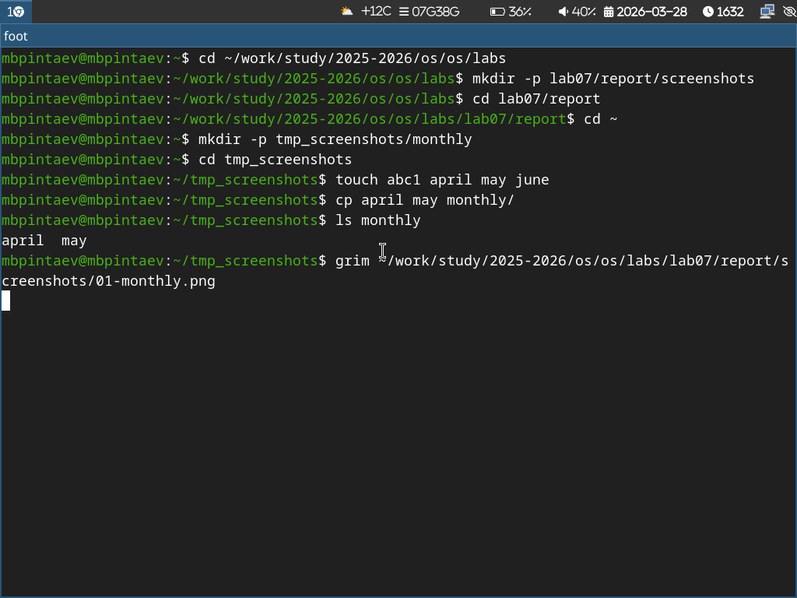

---
## Author
author:
  name: Пинтаев Максар Баирович
  email: 1032253534@pfur.ru
  affiliation:
    - name: Российский университет дружбы народов
      country: Российская Федерация
      postal-code: 117198
      city: Москва
      address: ул. Миклухо-Маклая, д. 6
 
## Title
title: "Презентация по лабораторной работе №7"
subtitle: "Анализ файловой системы Linux. Команды для работы с файлами и каталогами"
license: "CC BY"
date: today
date-format: "YYYY-MM-DD"
---
 
# Информация
 
## Докладчик
 
  * Пинтаев Максар Баирович
  * студент
  * Российский университет дружбы народов им. П. Лумумбы
  * [1032253534@pfur.ru](mailto:1032253534@pfur.ru)
  * <https://github.com/maksar-lab>
 
# Вводная часть
 
## Актуальность
 
- Файловая система — основа любой операционной системы
- Умение работать с файлами и каталогами — базовый навык администратора
- Понимание прав доступа необходимо для безопасности
 
## Цель и задачи
 
**Цель:** Ознакомление с файловой системой Linux, приобретение навыков работы с файлами и каталогами.
 
**Задачи:**
1. Изучить команды cp, mv, touch
2. Научиться изменять права доступа (chmod)
3. Освоить команду df для анализа диска
 
## Материалы и методы
 
- Операционная система: Fedora Sway
- Команды: touch, cp, mv, chmod, df
- Терминал Linux
 
# Содержание исследования
 
## Копирование файлов
 
Создание копий файлов в каталоге monthly (рис. @fig:ls-monthly).
 
{#fig:ls-monthly width=70%}
 
Копирование внутри каталога
Создание копии файла may с именем june (рис. @fig:ls-monthly-june).
 
{#fig:ls-monthly-june width=70%}
 
Копирование каталога
Копирование каталога monthly в monthly.00 (рис. @fig:ls-monthly00).
 
{#fig:ls-monthly00 width=70%}
 
Перемещение файлов
Перемещение файла july в monthly.00 (рис. @fig:mv-july).
 
{#fig:mv-july width=70%}
 
Права доступа
Добавление права на выполнение для владельца (рис. @fig:chmod-may).
 
{#fig:chmod-may width=70%}
 
Анализ файловой системы
Просмотр использования дискового пространства (рис. @fig:df).
 
{#fig:df width=70%}
 
Заключение
Результаты работы
Изучены команды cp, mv для работы с файлами и каталогами
 
Освоено изменение прав доступа через chmod
 
Научились анализировать дисковое пространство с помощью df
 
Выводы
В ходе работы приобретены практические навыки работы с файловой системой Linux, необходимы для администрирования и повседневной работы в системе.
