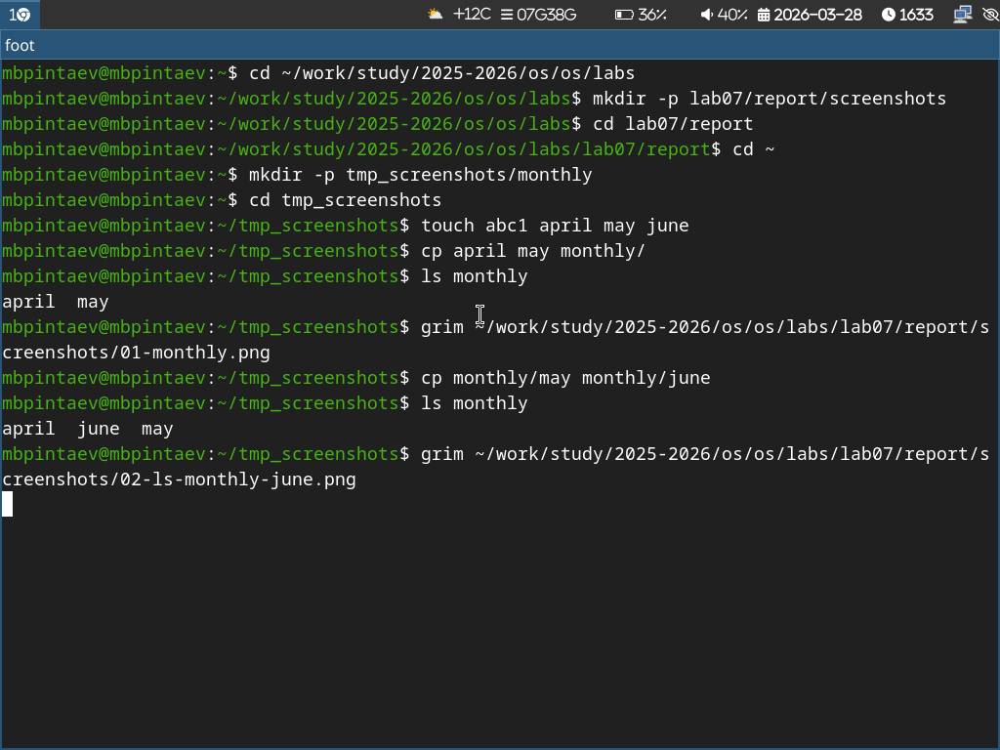
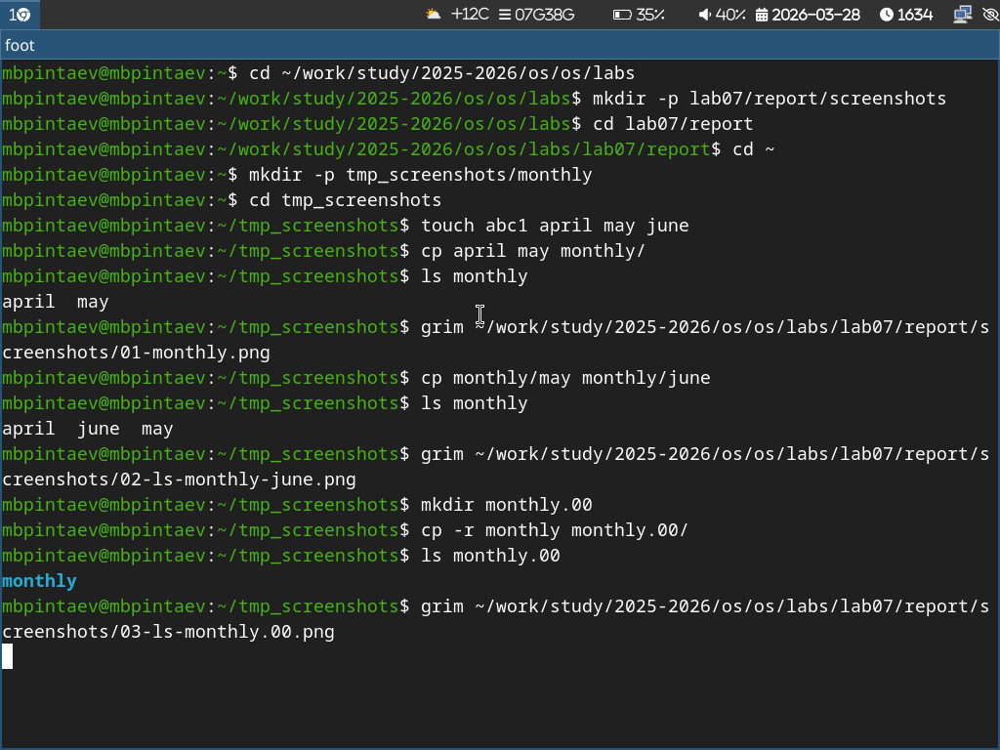
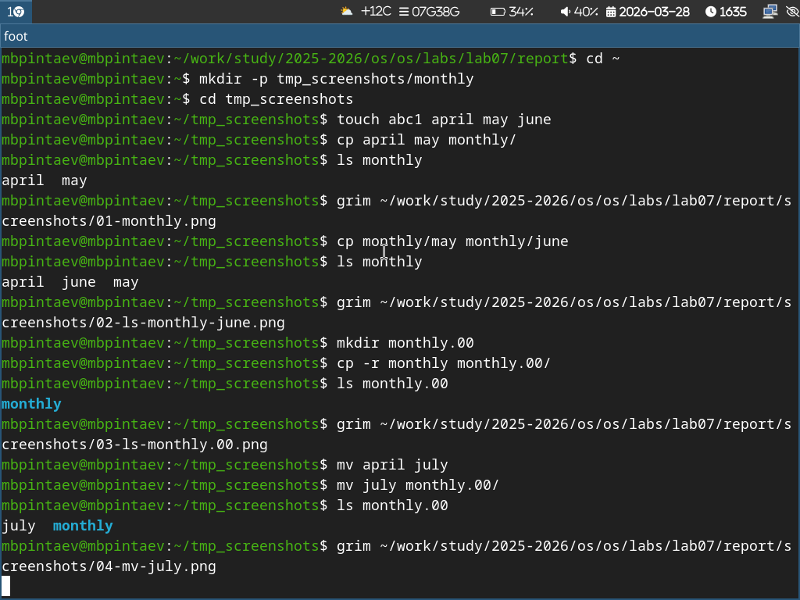
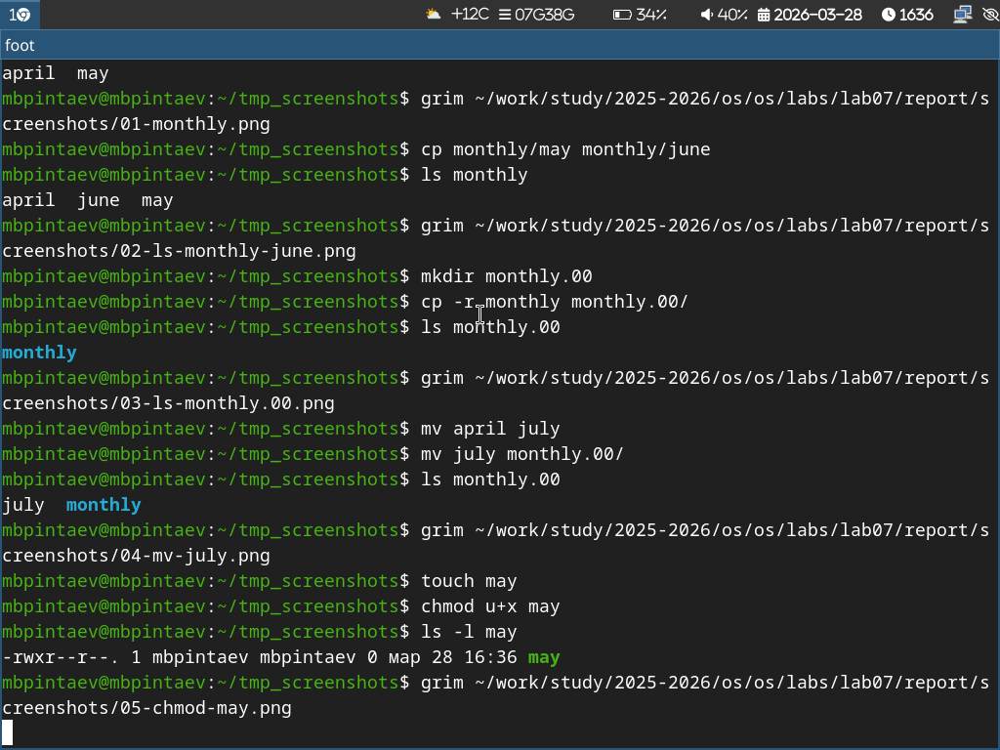
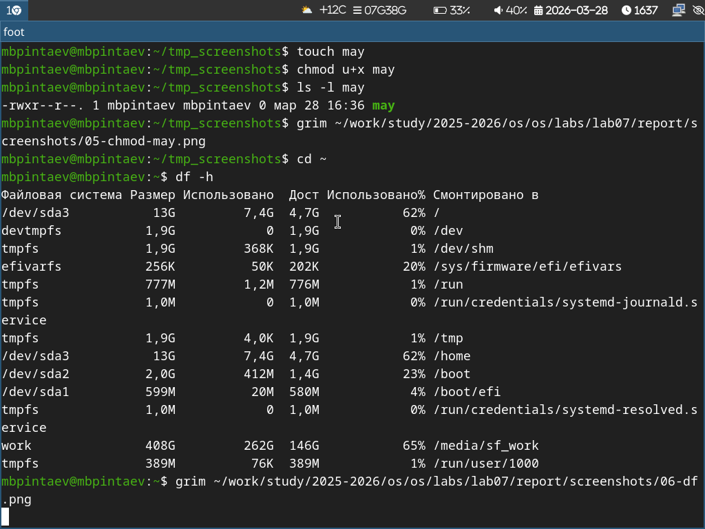

---
## Author
author:
  name: Пинтаев Максар Баирович
  email: 1032253534@pfur.ru
  affiliation:
    - name: Российский университет дружбы народов
      country: Российская Федерация
      postal-code: 117198
      city: Москва
      address: ул. Миклухо-Маклая, д. 6

## Title
title: "Отчёт по лабораторной работе №7"
subtitle: "Анализ файловой системы Linux. Команды для работы с файлами и каталогами"
license: "CC BY"
date: today
---

# Цель работы

Ознакомление с файловой системой Linux, её структурой. Приобретение практических навыков по применению команд для работы с файлами и каталогами.

# Задание

1. Выполнить команды для создания, копирования, перемещения файлов и каталогов.
2. Изучить права доступа и изменить их с помощью chmod.
3. Проанализировать файловую систему с помощью df.

# Выполнение лабораторной работы

## Создание и копирование файлов

В домашнем каталоге созданы файлы и каталог monthly. Выполнено копирование файлов (рис. @fig:ls-monthly).

{#fig:ls-monthly width=70%}

Внутри каталога monthly создана копия файла may с именем june (рис. @fig:ls-monthly-june).

{#fig:ls-monthly-june width=70%}

Создан каталог monthly.00 и скопировано содержимое monthly (рис. @fig:ls-monthly00).

{#fig:ls-monthly00 width=70%}

Перемещение файлов
Файл july перемещён в каталог monthly.00 (рис. @fig:mv-july).

{#fig:mv-july width=70%}

Права доступа
Создан файл may. Добавлено право на выполнение для владельца (рис. @fig:chmod-may).

{#fig:chmod-may width=70%}

Анализ файловой системы
Выполнен просмотр использования дискового пространства (рис. @fig:df).

{#fig:df width=70%}

Выводы
В ходе работы изучены команды для работы с файлами и каталогами (touch, cp, mv), права доступа и их изменение (chmod), а также команда df для анализа использования диска.
