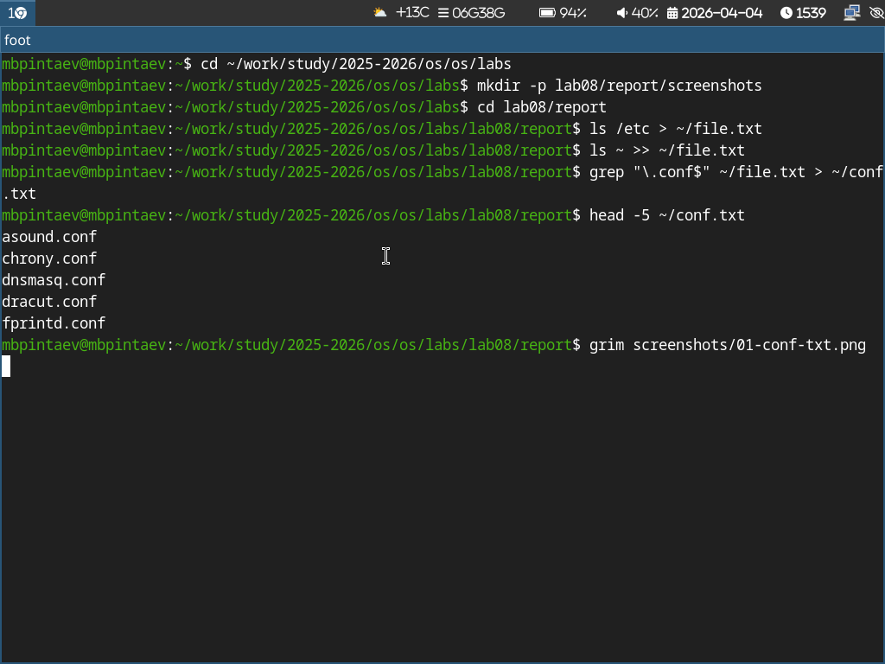
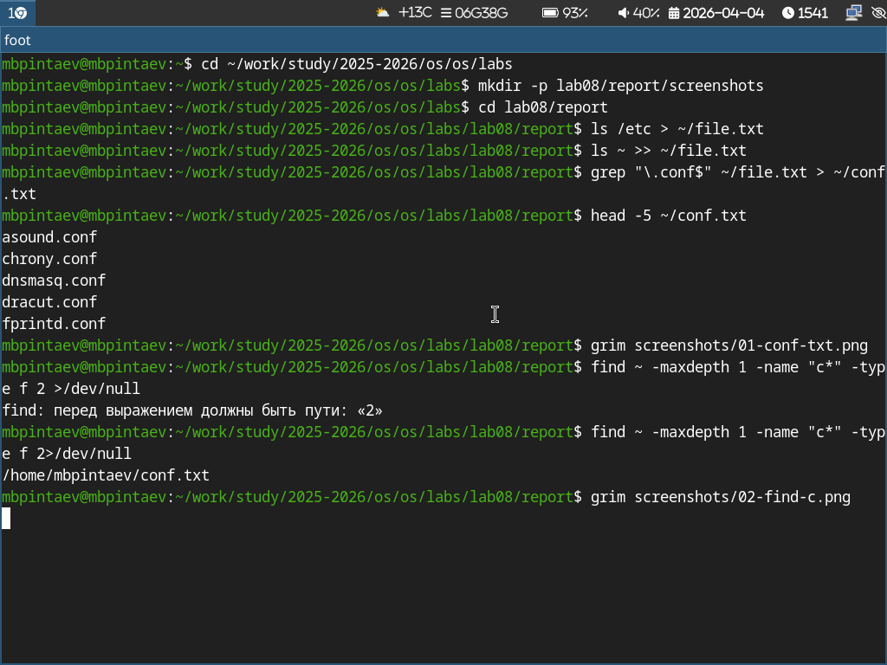
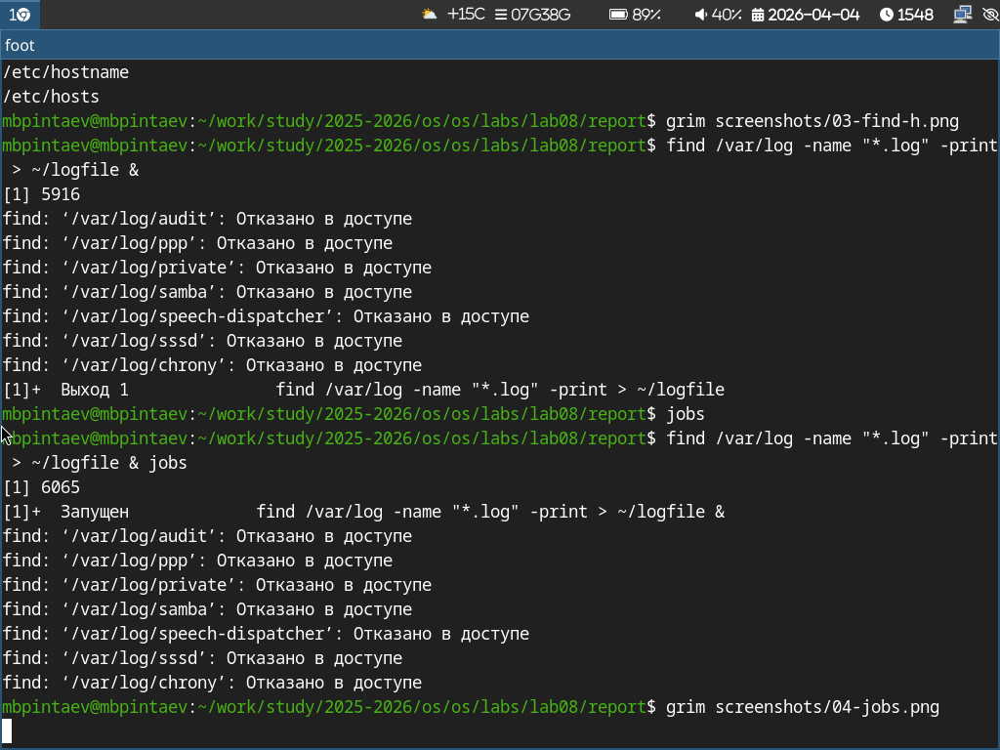

---
## Author
author:
  name: Пинтаев Максар Баирович
  email: 1032253534@pfur.ru
  affiliation:
    - name: Российский университет дружбы народов
      country: Российская Федерация
      postal-code: 117198
      city: Москва
      address: ул. Миклухо-Маклая, д. 6
 
## Title
title: "Презентация по лабораторной работе №8"
subtitle: "Поиск файлов. Перенаправление ввода-вывода. Просмотр запущенных процессов"
license: "CC BY"
date: today
date-format: "YYYY-MM-DD"
---
 
# Информация
 
## Докладчик
 
  * Пинтаев Максар Баирович
  * студент
  * Российский университет дружбы народов им. П. Лумумбы
  * [1032253534@pfur.ru](mailto:1032253534@pfur.ru)
  * <https://github.com/maksar-lab>
 
# Вводная часть
 
## Актуальность
 
- Поиск файлов и фильтрация данных — ежедневные задачи администратора
- Перенаправление потоков позволяет автоматизировать обработку данных
- Управление процессами необходимо для эффективной работы в Linux
 
## Цель и задачи
 
**Цель:** Ознакомление с инструментами поиска файлов и фильтрации текстовых данных.
 
**Задачи:**
1. Изучить перенаправление ввода-вывода (> , >>)
2. Освоить команды поиска файлов (find, grep)
3. Научиться управлять процессами (jobs, ps, kill)
4. Проанализировать дисковое пространство (df, du)
 
## Материалы и методы
 
- Операционная система: Fedora Sway
- Команды: grep, find, ps, jobs, kill, df, du
- Перенаправление потоков (> , >>, |)
 
# Содержание исследования
 
## Перенаправление ввода-вывода
 
Создан файл conf.txt со строками, содержащими ".conf" (рис. @fig:conf-txt).
 
{#fig:conf-txt width=70%}
 
Поиск файлов
Найдены файлы в домашнем каталоге, начинающиеся на c (рис. @fig:find-c).
 
{#fig:find-c width=70%}
 
Выведены файлы из /etc, начинающиеся на h (рис. @fig:find-h).
 
{#fig:find-h width=70%}
 
Управление процессами
Запущен фоновый процесс (рис. @fig:jobs).
 
{#fig:jobs width=70%}
 
Найден PID процесса gedit (рис. @fig:ps-grep).
 
{#fig:ps-grep width=70%}
 
Анализ дискового пространства
Просмотр использования дисков (рис. @fig:df).
 
{#fig:df width=70%}
 
Размер домашнего каталога (рис. @fig:du).
 
{#fig:du width=70%}
 
Заключение
Результаты работы
Изучены перенаправление потоков и конвейеры
 
Освоены команды find и grep для поиска файлов
 
Приобретены навыки управления процессами (jobs, ps, kill)
 
Научились анализировать дисковое пространство
 
Выводы
В ходе работы приобретены практические навыки поиска файлов, фильтрации данных, управления процессами и анализа дискового пространства в Linux.
