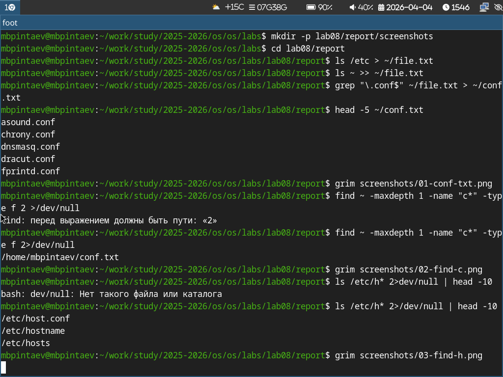
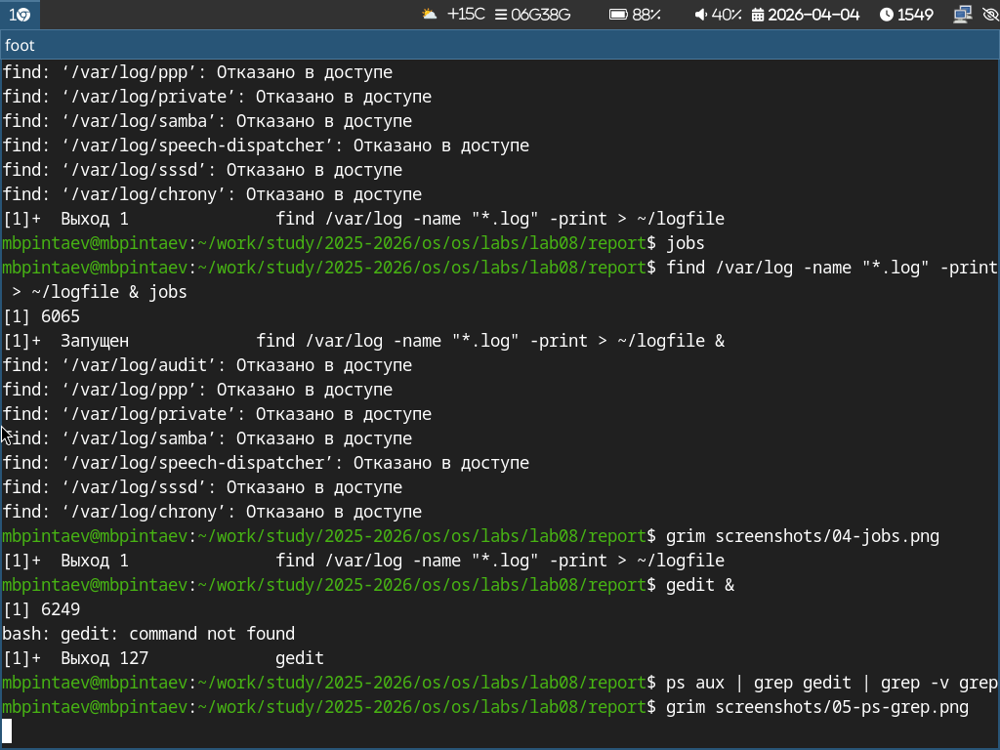
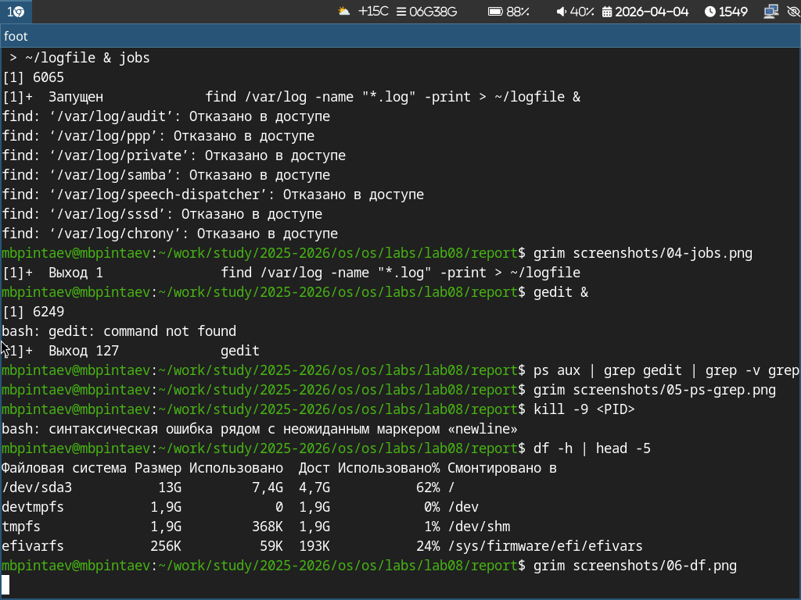
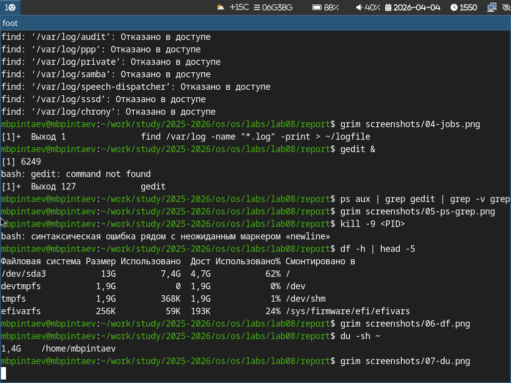

---
## Author
author:
  name: Пинтаев Максар Баирович
  email: 1032253534@pfur.ru
  affiliation:
    - name: Российский университет дружбы народов
      country: Российская Федерация
      postal-code: 117198
      city: Москва
      address: ул. Миклухо-Маклая, д. 6
 
## Title
title: "Отчёт по лабораторной работе №8"
subtitle: "Поиск файлов. Перенаправление ввода-вывода. Просмотр запущенных процессов"
license: "CC BY"
date: today
---
 
# Цель работы
 
Ознакомление с инструментами поиска файлов и фильтрации текстовых данных. Приобретение практических навыков по управлению процессами, по проверке использования диска.
 
# Задание
 
1. Работа с перенаправлением ввода-вывода.
2. Поиск файлов с помощью find и grep.
3. Управление процессами и задачами.
4. Анализ дискового пространства.
 
# Выполнение лабораторной работы
 
## Перенаправление ввода-вывода
 
Создан файл conf.txt, содержащий строки с ".conf" из file.txt (рис. @fig:conf-txt).
 
{#fig:conf-txt width=70%}
 
Поиск файлов
Найдены файлы в домашнем каталоге, начинающиеся на c (рис. @fig:find-c).
 
{#fig:find-c width=70%}
 
Выведены файлы из /etc, начинающиеся на h (рис. @fig:find-h).
 
{#fig:find-h width=70%}
 
Управление процессами
Запущен фоновый процесс и выведен список задач (рис. @fig:jobs).
 
{#fig:jobs width=70%}
 
Запущен gedit, найден его PID (рис. @fig:ps-grep).
 
{#fig:ps-grep width=70%}
 
Анализ диска
Просмотр использования дисков и размера домашнего каталога (рис. @fig:df, @fig:du).
 
{#fig:df width=70%}
 
{#fig:du width=70%}
 
Выводы
В ходе работы изучены команды перенаправления ввода-вывода (> , >>), поиска файлов (find, grep), управления процессами (jobs, ps, kill), а также df и du для анализа диска
