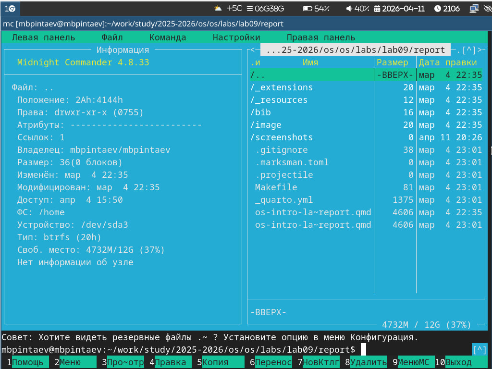
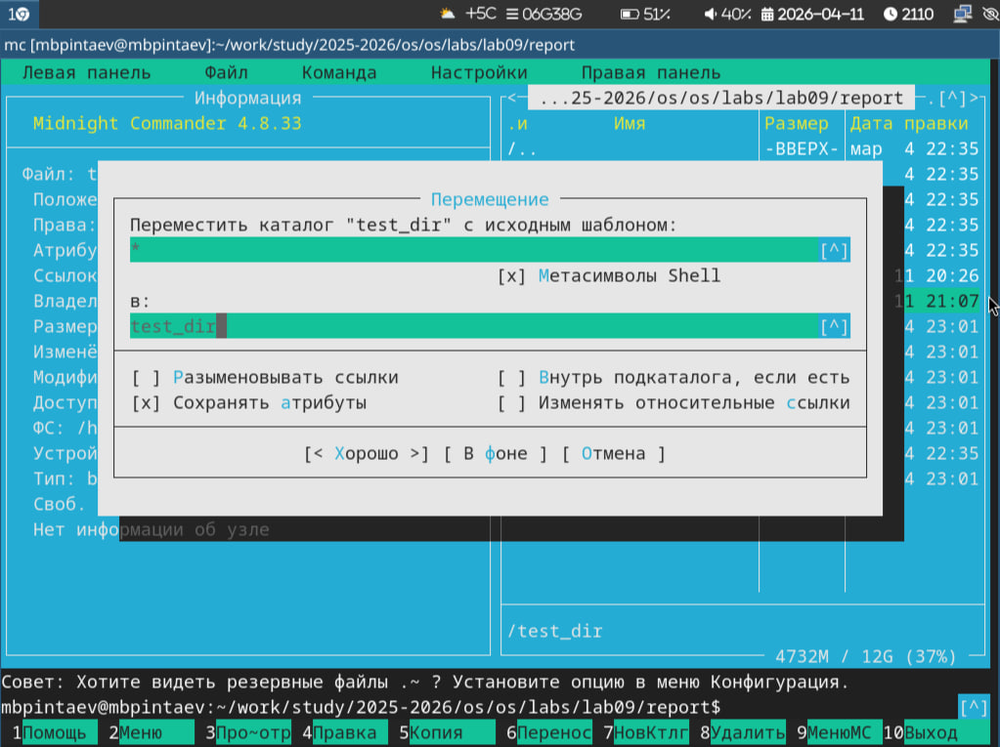

---
## Author
author:
  name: Пинтаев Максар Баирович
  email: 1032253534@pfur.ru
  affiliation:
    - name: Российский университет дружбы народов
      country: Российская Федерация
      postal-code: 117198
      city: Москва
      address: ул. Миклухо-Маклая, д. 6
 
## Title
title: "Презентация по лабораторной работе №9"
subtitle: "Командная оболочка Midnight Commander"
license: "CC BY"
date: today
date-format: "YYYY-MM-DD"
---
 
# Информация
 
## Докладчик
 
  * Пинтаев Максар Баирович
  * студент
  * Российский университет дружбы народов им. П. Лумумбы
  * [1032253534@pfur.ru](mailto:1032253534@pfur.ru)
  * <https://github.com/maksar-lab>
 
# Вводная часть
 
## Актуальность
 
- Midnight Commander — удобный инструмент для навигации по файловой системе
- Позволяет выполнять операции с файлами быстрее, чем в обычном терминале
- Встроенный редактор и поиск упрощают работу с текстом
 
## Цель и задачи
 
**Цель:** Освоение основных возможностей командной оболочки Midnight Commander.
 
**Задачи:**
1. Изучить интерфейс mc
2. Научиться выполнять операции с файлами и каталогами
3. Освоить встроенный редактор и поиск файлов
 
## Материалы и методы
 
- Операционная система: Fedora Sway
- Midnight Commander (mc)
- Встроенный редактор mc
 
# Содержание исследования
 
## Интерфейс Midnight Commander
 
Главный экран mc состоит из двух панелей, отображающих списки файлов (рис. @fig:mc-main).
 
{#fig:mc-main width=70%}
 
## Режим "Информация"
 
Панель может быть переключена в режим "Информация", отображающий сведения о файле и файловой системе (рис. @fig:info-panel).
 
{#fig:info-panel width=70%}
 
## Создание файла
 
В mc можно создать новый файл с помощью комбинации `Shift+F4` (рис. @fig:create-file).
 
{#fig:create-file width=70%}
 
## Копирование файлов
 
Копирование файлов выполняется клавишей `F5` (рис. @fig:copy-file).
 
{#fig:copy-file width=70%}
 
## Поиск файлов
 
Через меню `Команда → Поиск файла` можно найти файлы по шаблону (рис. @fig:search-files).
 
{#fig:search-files width=70%}
 
## Встроенный редактор
 
Для редактирования файлов используется клавиша `F4` (рис. @fig:editor).
 
{#fig:editor width=70%}
 
# Заключение
 
## Результаты работы
 
- Изучен интерфейс и основные возможности mc
- Освоены операции с файлами и каталогами
- Настроены режимы отображения панелей
- Изучен встроенный редактор и поиск файлов
 
## Выводы
 
Midnight Commander — мощная псевдографическая оболочка, значительно упрощающая работу с файловой системой в Linux.
