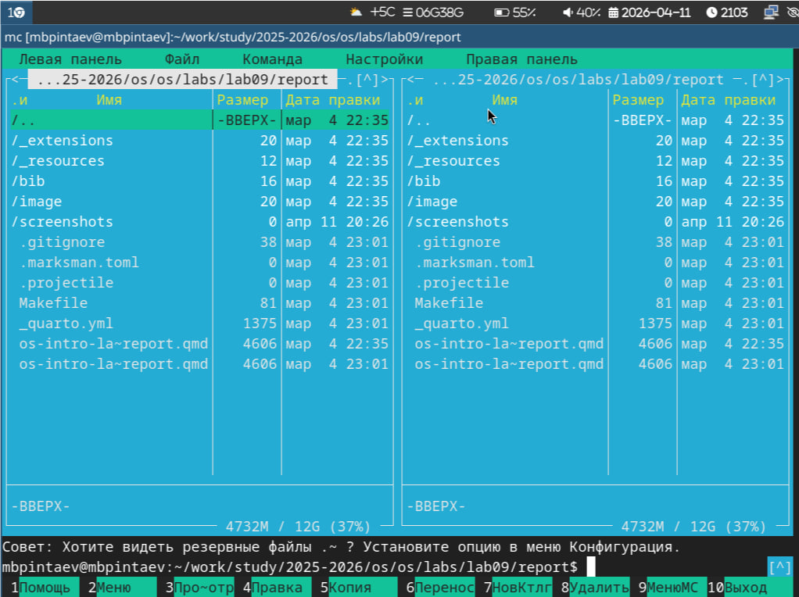
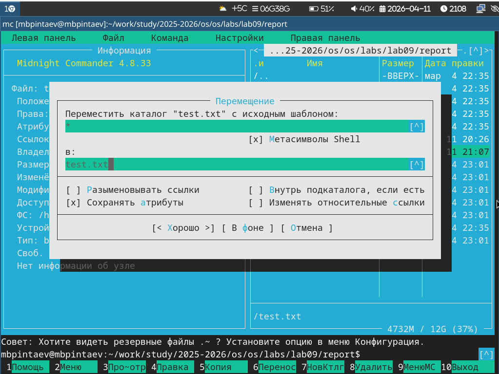
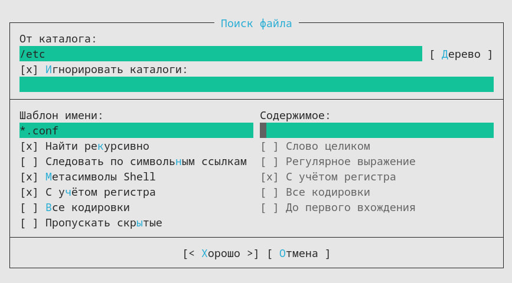
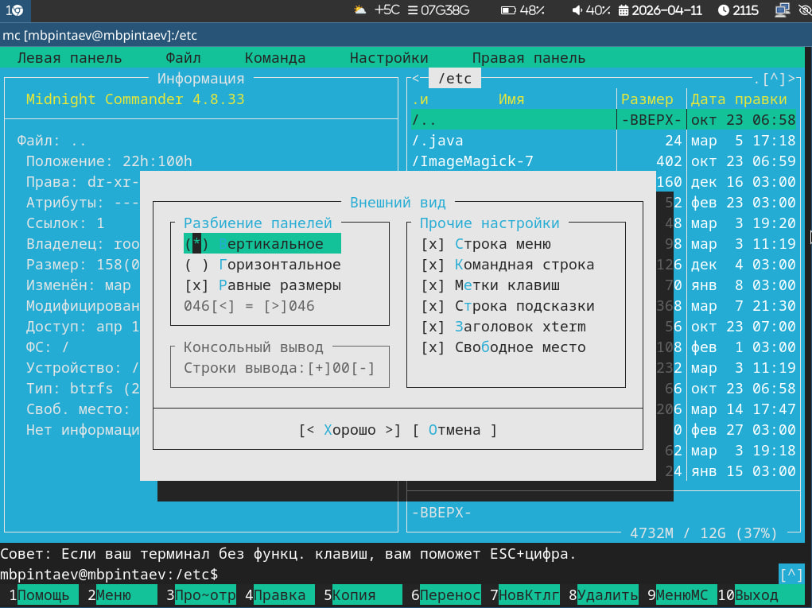

---
## Author
author:
  name: Пинтаев Максар Баирович
  email: 1032253534@pfur.ru
  affiliation:
    - name: Российский университет дружбы народов
      country: Российская Федерация
      postal-code: 117198
      city: Москва
      address: ул. Миклухо-Маклая, д. 6
 
## Title
title: "Отчёт по лабораторной работе №9"
subtitle: "Командная оболочка Midnight Commander"
license: "CC BY"
date: today
---
 
# Цель работы
 
Освоение основных возможностей командной оболочки Midnight Commander. Приобретение навыков практической работы по просмотру каталогов и файлов; манипуляций с ними.
 
# Задание
 
1. Изучить интерфейс и возможности mc.
2. Выполнить операции с файлами и каталогами.
3. Изучить меню Команда и Настройки.
4. Освоить работу со встроенным редактором.
 
# Выполнение лабораторной работы
 
## Запуск и интерфейс mc
 
Midnight Commander запущен командой `mc` (рис. @fig:mc-main).
 
{#fig:mc-main width=70%}
 
Режимы отображения панелей
Панель переведена в режим "Информация", отображающий сведения о файле и файловой системе (рис. @fig:info-panel).
 
{#fig:info-panel width=70%}
 
Создание и редактирование файлов
В mc создан новый файл с помощью комбинации Shift+F4 (рис. @fig:create-file).
 
{#fig:create-file width=70%}
 
Копирование файлов
Выполнено копирование файла с помощью клавиши F5 (рис. @fig:copy-file).
 
{#fig:copy-file width=70%}
 
Поиск файлов
Через меню Команда → Поиск файла выполнен поиск файлов *.conf в каталоге /etc (рис. @fig:search-files).
 
{#fig:search-files width=70%}
 
Встроенный редактор
Файл открыт для редактирования клавишей F4. Выполнены операции с текстом: вставка, удаление, копирование (рис. @fig:editor).
 
{#fig:editor width=70%}
 
Выводы
В ходе работы освоены основные возможности Midnight Commander: навигация по файловой системе, операции с файлами (копирование, перемещение, удаление, создание), поиск файлов, работа со встроенным редактором. Приобретены практические навыки работы с псевдографической командной оболочкой.
